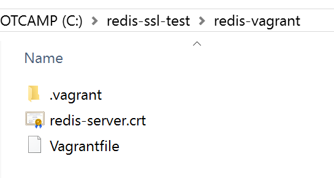
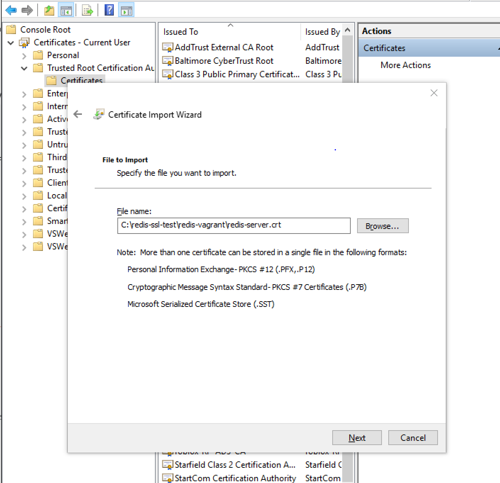
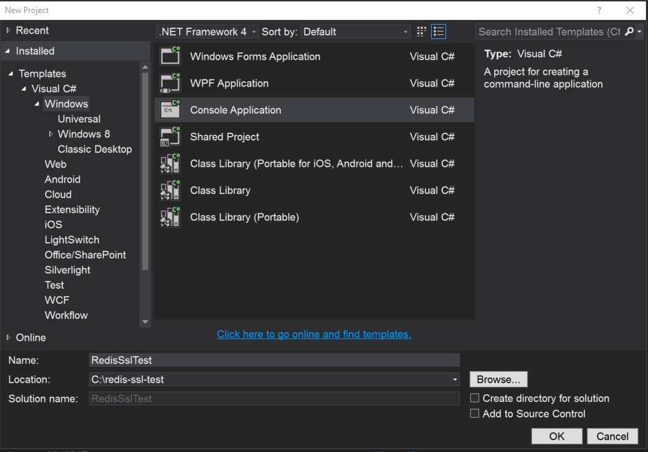

In this blog post, I will try to demonstrate how to setup a working environment with StackExchange.Redis package is communicating to a Redis box using SSL through STunel. 

By the end of this post, you will have a working environment on Vagrant like this:

<!--more-->

```nohighlight
                                           +------------------------------+
                                           |                              |
                                           |                 Vagrant Box  |
+--------------+                           +---------+       Ubuntu 14.04 |
|              |      +------------+       |         |                    |
|  C# Program  +------+    SSL     +-------+ STunnel +----+               |
|              |      +------------+       |         |    |               |
|              |                           +---------+    |               |
+--------------+                           |              |               |
                                           |              |               |
                                           |       +------v-------+       |
                                           |       |              |       |
                                           |       |              |       |
                                           |       |    Redis     |       |
                                           |       |              |       |
                                           |       |              |       |
                                           +-------+--------------+-------+

```


## Redis and SSL
Our first step is to install Redis and then generate a self-signed certificate to be able to connect through an STunnel.

For this post, we will use Ubuntu 14 on Vagrant, let me know if you want to know how to do it in AWS/Ubuntu 16.

## Setting up Vagrant

Open up the command line, create a new directory:
```
>cd C:\
>C:\mkdir redis-ssl-test
>C:\cd redis-ssl-test
>C:\redis-ssl-test> mkdir redis-vagrant
>C:\redis-ssl-test>cd redis-vagrant
>C:\redis-ssl-test\redis-vagrant> vagrant init
```

Open up your `Vagrant` file, and it should look like this:

```ruby
Vagrant.configure(2) do |config|
  config.vm.box = "ubuntu/trusty64"
  config.vm.hostname = "redis-stunnel"
  config.vm.network :private_network, ip: "10.0.15.10"
  config.vm.network "forwarded_port", guest: 6380, host: 6380
  config.vm.provider "virtualbox" do |vb|
    vb.memory = "4024"
  end
  config.vm.provision "shell", inline: <<-SCRIPT
    #!/bin/bash
    echo "Adding apt-repository"
    add-apt-repository -y ppa:chris-lea/redis-server
    echo "Updating and upgrading"
    apt-get update -y -qq > /dev/null
    apt-get upgrade -y -qq > /dev/null
    echo "Installing redis and stunnel"
    apt-get -y -q install redis-server stunnel4
  SCRIPT
end
```

Please note that the shell script is inline for convenience. There is nothing especial about this setup; we only forward port 6380 for our SSL communication.

Go back to the command line and type:
```
>C:\redis-ssl-test\redis-vagrant>vagrant up && vagrant ssh
```
You should be inside your test Ubuntu environment. Inside here let's see if we correctly installed Redis.

```
vagrant@redis-stunnel:~$ redis-cli ping
PONG
```

We don't have to do anything with redis; STunnel will be the one you configure. 

The next step is to enable STunnel, open up stunnel configuration file:
```
vagrant@redis-stunnel:~$ sudo vim /etc/default/stunnel4
```

And change `ENABLED=0` to `ENABLED=1`

```
. . .
ENABLED=1
. . .
```

After that, you need to create a public/private certificate. 

```
vagrant@redis-stunnel:~$ sudo openssl req -x509 -nodes -days 3650 -newkey rsa:4096 -keyout /etc/stunnel/redis-server.key -out /etc/stunnel/redis-server.crt
```

You will get some questions regarding the certificate; the most important ones are __Common Name__ and __Organization Name__. Make sure these match the IP address of your Vagrant box.

```
Country Name (2 letter code) [AU]:US
State or Province Name (full name) [Some-State]:
Locality Name (eg, city) []:
Organization Name (eg, company) [Internet Widgits Pty Ltd]:10.0.15.10
Organizational Unit Name (eg, section) []:
Common Name (e.g. server FQDN or YOUR name) []:10.0.15.10
Email Address []:
```

After generating the certificates, we will create a new configuration file for STunnel. This configuration will tell STunnel to __listen to an external port__ and redirect traffic to an internal port. In this case, we want STunnel listening to port 6380 and redirecting traffic to port 6379. 6379 is the default Redis port.

Go back to the command line and type:

```
vagrant@redis-stunnel:~$ sudo vim /etc/stunnel/redis.conf
```

And type the following configuration:

```
pid = /var/run/stunnel.pid

[redis-server]
cert = /etc/stunnel/redis-server.crt
key = /etc/stunnel/redis-server.key
accept = 6380
connect = 127.0.0.1:6379
```

The name inside the brackets `[redis-server]` is something we can name per our convenience.

Now you can restart STunnel service:

```
vagrant@redis-stunnel:~$ sudo service stunnel4 restart
```
Everything should be running correctly. You can confirm this by running:

```
vagrant@redis-stunnel:~$ sudo lsof -i :6379

COMMAND    PID  USER   FD   TYPE DEVICE SIZE/OFF NODE NAME
redis-ser 7131 redis    4u  IPv4  16619      0t0  TCP redis-stunnel:6379 (LISTEN)
```

### Installing certificate

The last step before going to VisualStudio is to install the new `crt` file into your certificate store.

In a real production environment, this should be defined beforehand (probably), but for now, you will install it as part of the Current User Root store.

To extract the public certificate from Vagrant, you have to make sure you're back into Windows command line.

```
C:\redis-ssl-test\redis-vagrant> vagrant ssh -c "sudo cat /etc/stunnel/redis-server.crt" > redis-server.crt
```

After that, the certificate file should be sitting next to the Vagrantfile.



To install the certificate, you can follow this steps:

* Windows + R -> mmc
* Click on File -> Add/Remove Snap-In
* Click on Certificates and then "Add >"
* A new dialog will popup, select "My user account" -> Finish
* Click OK
* Under Console Root, make sure to expand "Certificates - Current User."
* Click on "Trusted Root Certification Authorities" then on "Certificates" folder.
* You should see a lot of rows with CA
* Here click on "More Actions" at the right menu, then "All Tasks" and then "Import."
* A new dialog will show, click on Next and then Browse for your certificate file.
* Click Next, and then Next again and Finish.
* You will get a Security Warning question, answer Yes



I know, all those steps, there is a Powershell way to do it, but I will let that to you.

Once you finished, you will see your new certificate as the first entry on the CA list.

You can close the snap-in manager; you don't need to save console settings.

You're ready to go to Visual Studio and use the newly created certificate.

## C# simple project

You will create a simple C# Console application. 
Go to Visual Studio and click on _File -> New -> Project -> Console Application_

For your convenience you can set:

* Location: C:\redis-ssl-test
* Name: RedisSslTest
* Create directory for solution: unchecked.




You will need to add "StackExchange.Redis" NuGet package for this demo. 

Go to _Project -> Manage NuGet packages... -> Browse -> Search -> StackExchange.Redis_ -> Click Install.


The source code for connecting to Redis goes like this:

```csharp
using System;
using System.Security.Cryptography.X509Certificates;
using StackExchange.Redis;

namespace RedisSslTest
{
    class Program
    {
        static void Main(string[] args)
        {
            var configurationOptions = new ConfigurationOptions
            {
                EndPoints = { "10.0.15.10:6380" },
                Ssl = true
            };

            configurationOptions.CertificateSelection += OptionsOnCertificateSelection;

            var redis = ConnectionMultiplexer.Connect(configurationOptions);
            var db = redis.GetDatabase();
            db.ListLeftPush("test", "from c#");
            Console.ReadKey();
        }

        private static X509Certificate OptionsOnCertificateSelection(object s, string t, X509CertificateCollection local, X509Certificate remote, string[] a)
        {
            const StoreName storeName = StoreName.Root;
            const StoreLocation certificateStoreLocation = StoreLocation.CurrentUser;
            const X509FindType findType = X509FindType.FindBySubjectName;
            var certificateAuthorityStore = new X509Store(storeName, certificateStoreLocation);

            certificateAuthorityStore.Open(OpenFlags.ReadOnly);

            var certificatesInStore = certificateAuthorityStore
                .Certificates
                .Find(findType, "10.0.15.10", true);

            return certificatesInStore[0];
        }
    }
}

```

The magic of this code happens at the handling of `CertificateSelection`. 
Here we read the certificates installed on our computer, in this case, Current User, 
and let the Redis package now it will need it to communicate through SSL to our local Vagrant machine.

I wanted to show you the hard way of installing the certificate because when I was doing testing, 
always got an exception if __I didn't install the certificate first as part of the machine.__

The easier way to do it, and the way you will find it on examples is like this:

```csharp
using System;
using System.Security.Cryptography.X509Certificates;
using StackExchange.Redis;

namespace RedisSslTest
{
    class Program
    {
        static void Main(string[] args)
        {
            var configurationOptions = new ConfigurationOptions
            {
                EndPoints = { "10.0.15.10:6380" },
                Ssl = true
            };

            configurationOptions.CertificateSelection += OptionsOnCertificateSelection;

            var redis = ConnectionMultiplexer.Connect(configurationOptions);
            var db = redis.GetDatabase();
            db.ListLeftPush("test", "from c#");
            Console.ReadKey();
        }

        private static X509Certificate OptionsOnCertificateSelection(object s, string t, X509CertificateCollection local, X509Certificate remote, string[] a)
        {
            return new X509Certificate2(@"C:\redis-ssl-test\redis-vagrant\redis-server.crt");
        }
    }
}
```

Either way if you back to your Vagrant box, you can type:

```
vagrant@redis-stunnel:~$ redis-cli
127.0.0.1:6379> lrange test 0 -1
1) "from c#"
2) "from c#"
```


## Conclusion

Most of the problems I had while trying this setup was the `CertificateSelection` handler.  Most examples online never combine having a self-signed certificate that won't communicate to SSL directly and debugging `StackExchange.Redis` made it it easy.

My only complaint is that `StackExchange.Redis` swallows the exception that tells you [exactly what's going on ](https://github.com/StackExchange/StackExchange.Redis/blob/master/StackExchange.Redis/StackExchange/Redis/PhysicalConnection.cs#L792)


