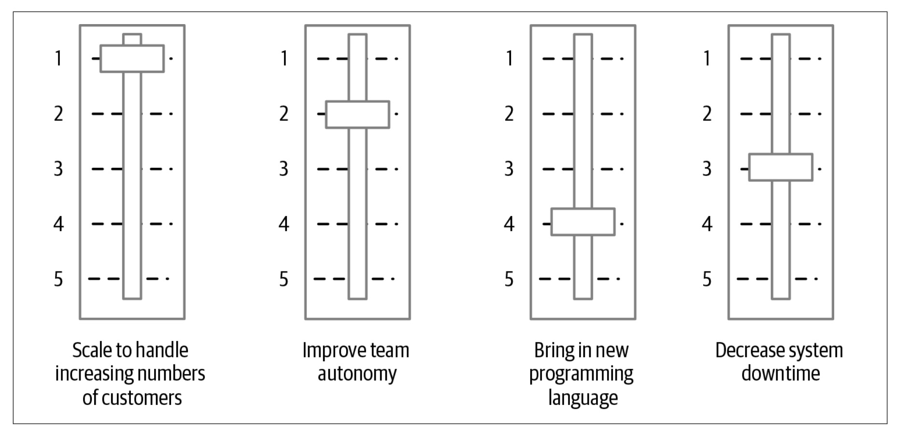

## Summary

Chapter 2 of Sam Newman’s Monolith to Microservices is a masterclass in the art of thoughtful planning before diving into the technicalities of a microservices migration. This chapter underscores a key principle: microservices should never be the end goal but rather a deliberate means to achieve broader business and technical objectives.

## Defining the Why Behind Microservices

Newman begins by dismantling the myth that microservices are a silver bullet for every system. Instead, he emphasizes the importance of aligning the migration with tangible outcomes, such as:

- Enabling team autonomy.
- Accelerating time to market.
- Scaling for load and operational costs.
- Improving robustness or developer scalability.

Clear goals are essential. Without them, organizations risk chasing trends without a clear understanding of why they’re investing in microservices, leading to fragmented initiatives and wasted resources. Newman offers three guiding questions for assessing readiness:

1. What are you hoping to achieve?
2. Have you considered alternatives?
3. How will you measure success?

[Read Chapter 1: "Just Enough Microservices"](/posts/monolith-to-microservices-introduction/)

## Trade-offs: The Slippery Slope of Complexity

One of the most striking insights in the chapter is how easily teams can get sidetracked by competing priorities and shiny new tools. Newman warns against conflating goals with methods, like introducing Kafka or adopting Kotlin just because they seem modern, without assessing their alignment with core objectives. This is where his “slider model” becomes invaluable: it helps teams prioritize what matters most while de-prioritizing distractions.

In practice, Newman advocates for incremental, goal-driven change. By clearly identifying the primary driver for the migration—whether it’s faster deployments or improved team autonomy—teams can stay focused on measurable progress. Secondary benefits, while appealing, should not detract from the primary objective.

## Incremental Migration: Think Marble, Not Explosions

A recurring theme is the value of incrementalism. Newman likens a monolith to a block of marble: you could blow it up all at once, but that rarely ends well. Instead, he advises gradually chipping away, extracting one service at a time. This method allows teams to learn as they go, iterate based on feedback, and avoid the pitfalls of an all-or-nothing approach.

Incremental migration also limits the scope of errors. For instance, extracting a small, independent piece of functionality lets teams validate the new microservice in production without disrupting the entire system. Newman’s advice mirrors Martin Fowler’s sentiment:

> “If you do a big-bang rewrite, the only thing you’re guaranteed is a big bang.”

## Practical Guidance for Getting Started

Newman provides actionable strategies for identifying where to begin:

- Domain-Driven Design (DDD): Use bounded contexts to define logical service boundaries that align with business domains.
- Prioritization Quadrants: Plot potential services on two axes—value and difficulty—to identify quick wins and balance complexity with impact.
- Event Storming: Collaboratively map domain events to gain shared understanding and clarify the system’s decomposition strategy.

These methods ensure that teams focus their initial efforts on extracting functionality that provides high value with manageable complexity. For example, extracting invoicing functionality might be a logical first step if it has minimal dependencies and aligns with core goals.

## Cultural and Organizational Impacts

Transitioning to microservices isn’t just a technical challenge—it’s a cultural one. Newman highlights the need for organizational alignment, drawing parallels between team silos and tightly coupled systems. To succeed, teams must break down these barriers and embrace shared ownership of services.

He also touches on the dangers of copying organizational structures or practices from companies like Spotify or Netflix without considering context. Instead, he advises “copying the questions, not the answers,” tailoring changes to the specific needs of your organization.

## Lessons in Measurement and Feedback

The chapter emphasizes the importance of measuring progress and learning from each step. Success isn’t just about extracting a service; it’s about deploying it into production and observing its impact. Only in real-world use can teams uncover hidden issues like latency, cascading failures, or integration challenges.

This approach ensures that teams stay nimble, able to pivot when something doesn’t work as expected. Newman also stresses the value of creating short-term wins to build momentum and maintain morale throughout the migration.

## A Thoughtful Framework for Transformation

Newman’s framework for planning a migration is refreshingly pragmatic, focusing on:

- Clear objectives tied to business outcomes.
- Awareness of trade-offs and competing priorities.
- Incremental progress through small, measurable steps.

For anyone considering microservices, Chapter 2 serves as a vital reminder: success depends not on the architecture itself but on how well it aligns with your team’s goals, your system’s needs, and your organization’s capacity for change.

As the journey continues in Chapter 3, Newman dives deeper into techniques for effective decomposition. But Chapter 2 lays the groundwork for making those decisions with clarity and purpose—ensuring that microservices become a tool for progress, not just another trend to follow.

[Explore Chapter 1: "Just Enough Microservices"](/posts/monolith-to-microservices-introduction/)
