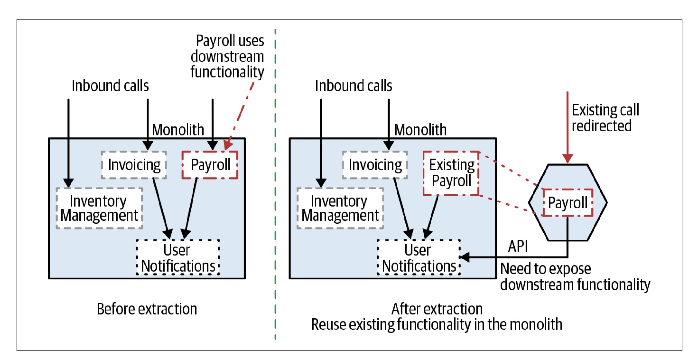

## Overview

Chapter 3, Splitting the Monolith, focuses on practical approaches to decomposing monolithic systems incrementally rather than through disruptive big bang rewrites. It introduces migration patterns like the Strangler Fig and Branch by Abstraction while emphasizing the importance of balancing technical feasibility with organizational realities.

[Read Chapter 2 Summary: "Planning a Migration"](/posts/monolith-to-microservices-chapter-2-summary/)  
[Read Chapter 1 Summary: "Just Enough Microservices"](/posts/monolith-to-microservices-introduction/)

## Incremental migrations

Newman argues that migrating incrementally allows teams to learn, adapt, and rollback changes if necessary. Acknowledging that many teams skip refactoring the monolith entirely, he notes that clean-room implementations—building new services from scratch—are often more practical, though riskier when undertaken at a large scale.

## Patterns

Newman explores key migration patterns, their applications, and their trade-offs:

### 1. Strangler Fig Application

Inspired by the tree that envelops its host, this pattern gradually replaces monolithic functionality with microservices. Its steps include:

- Identifying parts of the system to migrate.
- Implementing functionality in a new microservice.
- Redirecting calls to the microservice while ensuring reversibility.
- This pattern is ideal for HTTP-driven systems and enables gradual change without disrupting the existing monolith.

### 2. Branch by Abstraction

Useful when functionality to extract lies deep within the monolith. It involves:

- Creating an abstraction layer.
- Updating clients to use this abstraction.
- Building new functionality behind the abstraction and switching over incrementally.
- While more complex, this pattern reduces disruption to ongoing development.

### 3. Parallel Run

Both old and new implementations run simultaneously to verify correctness before switching over. This is especially useful for critical systems but requires significant effort.

### 4. Decorating Collaborator

Allows triggering microservices based on monolith outputs without modifying the monolith. It’s a lightweight approach for cases where changing the monolith is infeasible.

## The Role of Proxies

Proxies, such as HTTP reverse proxies, play a pivotal role in redirecting calls from the monolith to microservices. They enable incremental rollouts and support patterns like Strangler Fig by keeping deployment and release separate.

## Handling State and Data Migration

Data migration is a critical challenge when splitting monoliths. Newman emphasizes planning for state migration, acknowledging that services may need to share or synchronize data during transitions. These complexities will be discussed further in later chapters.

## Organizational Considerations

Migration patterns must align with team structures and development workflows. Newman stresses that migration work should integrate seamlessly with feature delivery, avoiding the dichotomy of "technical debt" versus "feature stories."

## Key Takeaways

- Incremental migration allows for learning, adaptation, and rollback, minimizing risks.
- Migration patterns like Strangler Fig and Branch by Abstraction balance flexibility with practicality.
- Proxies and abstractions are essential tools for redirecting calls and enabling smooth transitions.
- Plan for data migration early; shared data introduces significant complexity.
- Integrate migration work with regular feature delivery to maintain momentum.

## Noteworthy Quotes

- “Think of our monolith as a block of marble. We could blow the whole thing up, but that rarely ends well.” (p. 75)
- “Separating the concepts of deployment from release is important.” (p. 80)
- “Make sure you understand the pros and cons of each of these patterns.” (p. 78)

## Questions or Topics for Further Discussion

1. How can teams identify the best functionality to migrate first?
2. What strategies can mitigate the challenges of shared databases during transitions?
3. How do organizational structures influence the choice of migration patterns?

Chapter 3 provides actionable techniques for decomposing monoliths while addressing both technical and organizational complexities. Its focus on incrementalism and thoughtful planning makes it an essential guide for teams embarking on the microservices journey.

[Read Chapter 2 Summary: "Planning a Migration"](/posts/monolith-to-microservices-chapter-2-summary/)  
[Read Chapter 1 Summary: "Just Enough Microservices"](/posts/monolith-to-microservices-introduction/)
