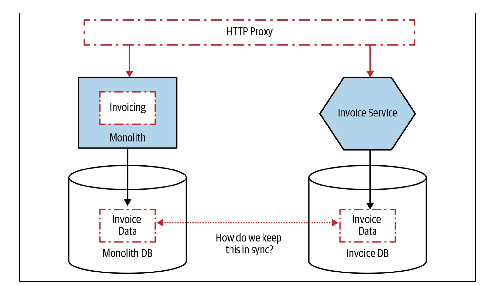

## Overview

Chapter 4 of Sam Newman’s Monolith to Microservices tackles one of the most challenging aspects of transitioning to microservices: decomposing the monolithic database. Newman provides practical guidance on managing shared data, splitting schemas, handling distributed transactions, and adopting incremental approaches to achieve database independence. The chapter emphasizes balancing technical complexity with business goals while avoiding common pitfalls.

[Read Chapter 3 Summary](/posts/monolith-to-microservices-chapter-3-summary/)

## Splitting Databases Incrementally

Newman advises against attempting an all-at-once split of the database. Instead, teams should decouple services incrementally:

- Logical Separation: Start by isolating schemas while keeping them on the same database instance.
- Physical Separation: Move to distinct database engines as services mature.

While logical separation reduces immediate costs and complexity, physical separation ensures scalability and robustness by eliminating shared failure points.

## Patterns for Splitting Data

Several strategies for database decomposition are explored:

- Split Table: Break monolithic tables into smaller ones aligned with service boundaries.
- Move Foreign-Key Relationships to Code: Replace database-enforced constraints with application-layer logic, trading complexity for flexibility.
- Monolith as Data Access Layer: Use the monolith as a gateway to the database during the transition period.
- Multischema Storage: Store new data in service-specific schemas while continuing to read legacy data from the monolith.

Newman emphasizes the importance of aligning data migration with service boundaries to ensure clarity and maintainability.

## Managing Static Reference Data

Shared reference data like country codes or currencies can become a bottleneck if not handled properly. Newman suggests various strategies based on data complexity:

- Duplicate data within each service to reduce dependencies.
- Use shared libraries for small, infrequently changing data.
- Build dedicated reference data services for dynamic or complex datasets.

## Distributed Transactions vs. Sagas

As databases are decomposed, services lose the ability to rely on ACID transactions for operations that span multiple services. Newman critiques distributed transactions like two-phase commits for their complexity and fragility, advocating for sagas instead:

- Sagas split workflows into smaller, service-local transactions, using compensating actions for rollback in case of failure.
  - Orchestrated Sagas: A central controller coordinates steps, offering visibility but adding coupling.
  - Choreographed Sagas: Services communicate via events, promoting loose coupling but requiring careful event correlation.

## Synchronizing Data

During the migration, keeping data synchronized between the monolith and microservices is essential but difficult. Newman introduces:

- Tracer Write: Duplicate writes to both the monolith and the new service.
- Application Synchronization: Synchronize data at the application level for better control.

These strategies ensure data consistency during the transition while allowing for rollback when needed.

## Key Takeaways

1. Shared databases impede microservices by introducing tight coupling and increasing schema change risks.
2. Incremental migration—starting with logical separation—reduces disruption and allows teams to learn and adapt.
3. Patterns like Split Table and Move Foreign-Key Relationships to Code enable gradual database decomposition while addressing interdependencies.
4. Static reference data should be managed carefully, with approaches tailored to data complexity and usage frequency.
5. Sagas are the preferred pattern for managing distributed transactions, offering flexibility and scalability compared to two-phase commits.
6. Data synchronization strategies like tracer writes and application-level syncing help maintain consistency during migration.

[Read Chapter 3 Summary](/posts/monolith-to-microservices-chapter-3-summary/)
