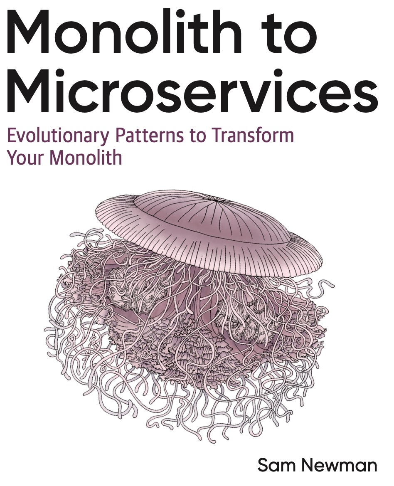

## The Journey to Just Enough Microservices

In software architecture, one question looms large over those managing complex systems: How do you rearchitect an existing system without stopping all other work on it? This question, posed in the foreword of Sam Newman’s Monolith to Microservices: Evolutionary Patterns to Transform Your Monolith, resonates deeply with me. It encapsulates the core tension between maintaining product delivery and investing in technical evolution—a balancing act that every engineering team struggles to perfect.

Chapter 1, titled "Just Enough Microservices," sets the stage for the book by addressing foundational ideas about microservice architectures. It challenges misconceptions, explores the core principles of microservices, and provides a pragmatic lens for understanding their strengths and trade-offs. Newman doesn’t just define microservices—he shows us why they matter, what they can achieve, and, crucially, what they can cost.

## Redefining Architecture Around Business Domains

One of the chapter’s most powerful insights is the idea that microservices should reflect slices of business functionality, not just technical layers. Newman describes a common trap in monolithic systems where business logic is spread across the user interface, backend, and database, creating a tightly coupled architecture that slows down even minor changes. He contrasts this with a microservice model where services encapsulate functionality end-to-end, integrating UI, logic, and data storage within a single cohesive unit.

For anyone familiar with the challenges of monolithic systems, this principle is revelatory. It reframes architecture as a tool for aligning teams and technology with business outcomes. In my own work, I’ve seen how organizing services around domains can transform team dynamics, reducing hand-offs and increasing ownership. Yet, Newman acknowledges the difficulty of this shift—it’s not just about splitting code but also rethinking data ownership and how services communicate.

## The Unavoidable Challenge of Coupling

Microservices offer the tantalizing promise of independence, allowing teams to deploy and scale services without waiting for others. But Newman is unflinching in his critique of one of the biggest barriers to this independence: shared databases. He argues that services must own their own data, exposing it only through stable APIs. This approach ensures loose coupling, where changes within one service don’t cascade across the system.

At first glance, this might seem straightforward, but as Newman points out, the real challenge lies in defining clear ownership of data and managing requests between services. For example, if an Order service needs customer information, should it query the Customer service or maintain its own copy? These decisions require careful consideration of trade-offs, as overly tight coupling can erode the flexibility that microservices are meant to provide.

In my experience, transitioning away from shared databases is one of the most contentious and technically challenging aspects of adopting microservices. It’s not just a technical hurdle—it’s a cultural one. Teams must embrace the idea that transactional consistency is often a luxury in distributed systems, replaced instead by eventual consistency and asynchronous communication. This shift takes time and trust to implement effectively.

## Microservices: Flexibility with a Cost

As the chapter unfolds, Newman makes it clear that microservices are not a panacea. While they offer unparalleled flexibility, allowing teams to innovate and scale independently, this flexibility comes at a price. Distributed systems are inherently more complex than monoliths, introducing challenges like network latency, service failures, and data synchronization. These issues demand new skills, tools, and operational practices.

Newman wisely cautions against adopting microservices for their own sake. Instead, he urges readers to consider whether the benefits outweigh the costs in their specific context. His pragmatic stance reminds me of a recurring question in my own work: How many microservices can we realistically manage as a team? For a team of three backend engineers, the answer might be just a handful, while a larger organization with mature DevOps practices might handle dozens or even hundreds.

## Lessons in Incremental Change

Perhaps the most reassuring message in Chapter 1 is that transitioning to microservices doesn’t require an all-or-nothing approach. Newman advocates for incremental migration, starting small and expanding as teams gain confidence and competence. This mirrors my own approach to architecture evolution: tackling manageable slices of functionality rather than attempting a full-scale transformation all at once.

The chapter also emphasizes the importance of understanding the problem domain. By grounding architecture in domain-driven design principles, teams can identify natural boundaries for their services, reducing the friction of change. Newman touches on techniques like "outside-in thinking," where interfaces are designed with consumers’ needs in mind—a principle that resonates deeply with my own philosophy of prioritizing usability in APIs.

## A Thoughtful Start to a Complex Journey

"Just Enough Microservices" is a fitting title for this chapter because it captures the essence of Newman’s advice: focus on what’s necessary, not what’s fashionable. Microservices can unlock incredible potential, but only if approached with a clear understanding of their purpose and limitations. This measured perspective is a refreshing antidote to the hype that often surrounds new architectural paradigms.

As I reflect on this chapter, I’m struck by its relevance to the ongoing tension between product and engineering priorities. It’s a reminder that good architecture isn’t just about technology—it’s about aligning systems with the needs of the business and the capabilities of the team. For anyone embarking on a microservices journey, Newman’s insights provide a critical foundation for making thoughtful, informed decisions.

In the next post, we’ll explore Chapter 2: "Planning a Migration," where Newman delves into how to assess whether microservices are the right fit for your organization and how to approach the transition. If Chapter 1 is about understanding the why, Chapter 2 is about tackling the how.