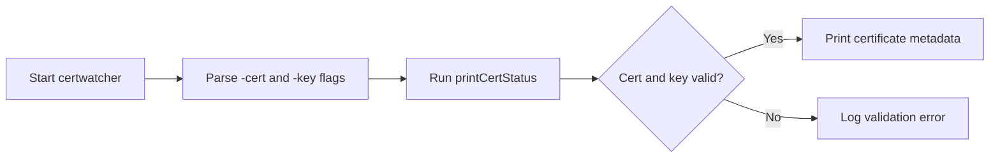
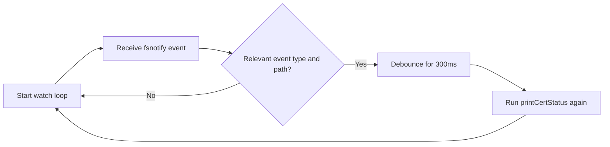
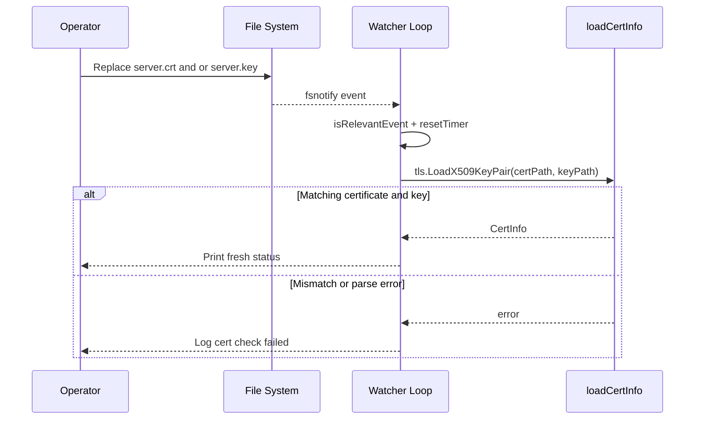
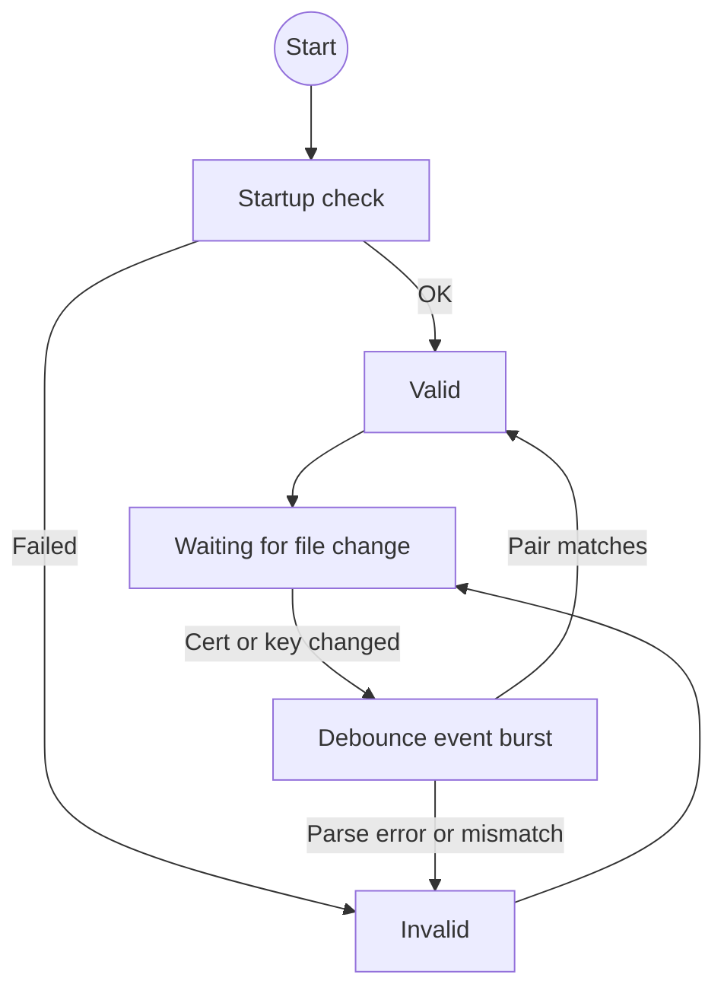

Certificate issues are operational issues. Expiration, bad key pairing, and silent file replacement can break TLS quickly.

This post walks through a tiny watcher you can run during development or in a small server environment. You will build a Go CLI that:

1. Loads a certificate and private key from disk.
1. Verifies they form a valid pair.
1. Prints key certificate metadata.
1. Watches both files and rechecks when they change.

The code uses standard library plus `fsnotify` for file system events.

## What you will build

Final command:

```bash
go run . -cert ./server.crt -key ./server.key
```

Output example:

```text
cert loaded successfully
subject: localhost
issuer: localhost dev CA
dns names: localhost
valid from: 2026-04-26 10:00:00 +0000 UTC
valid until: 2026-04-27 10:00:00 +0000 UTC
expires in: 23h59m59s

watching certificate files...
```

When either file changes, the watcher runs the same validation again and prints fresh status.

### Runtime flow diagrams

The runtime has two small loops. The first loop runs once at startup and proves the current files are usable. The second loop waits for file system events and triggers the same check again after a short debounce.

Startup validation:



File change loop:



## Prerequisites

- Go 1.22 or newer
- OpenSSL for local test certificates

## Step 1: Project setup

```bash
mkdir certwatcher
cd certwatcher
go mod init example.com/certwatcher
go get github.com/fsnotify/fsnotify
```

## Step 2: Write `main.go`

The code below is complete and runnable. Comments explain each section and why it exists.

```go
package main

import (
	"crypto/tls"
	"crypto/x509"
	"flag"
	"fmt"
	"log"
	"path/filepath"
	"strings"
	"time"

	"github.com/fsnotify/fsnotify"
)

// CertInfo holds the fields we care about for operational visibility.
// Keeping this focused makes output easy to scan.
type CertInfo struct {
	Subject   string
	Issuer    string
	DNSNames  []string
	NotBefore time.Time
	NotAfter  time.Time
}

func main() {
	// Accept cert and key file paths from CLI flags.
	certPath := flag.String("cert", "", "path to certificate file, for example server.crt")
	keyPath := flag.String("key", "", "path to private key file, for example server.key")
	flag.Parse()

	// Fail fast on missing required input.
	if *certPath == "" || *keyPath == "" {
		log.Fatal("usage: certwatcher -cert server.crt -key server.key")
	}

	// Run one check immediately so startup confirms current file state.
	if err := printCertStatus(*certPath, *keyPath); err != nil {
		log.Printf("initial cert check failed: %v", err)
	}

	// Start watching file system events and re-run checks after changes.
	if err := watch(*certPath, *keyPath); err != nil {
		log.Fatal(err)
	}
}

func printCertStatus(certPath, keyPath string) error {
	info, err := loadCertInfo(certPath, keyPath)
	if err != nil {
		return err
	}

	fmt.Println("cert loaded successfully")
	fmt.Printf("subject: %s\n", info.Subject)
	fmt.Printf("issuer: %s\n", info.Issuer)

	// Print DNS names in one line to keep logs compact.
	if len(info.DNSNames) > 0 {
		fmt.Printf("dns names: %s\n", strings.Join(info.DNSNames, ", "))
	} else {
		fmt.Println("dns names: <none>")
	}

	fmt.Printf("valid from: %s\n", info.NotBefore)
	fmt.Printf("valid until: %s\n", info.NotAfter)
	fmt.Printf("expires in: %s\n", time.Until(info.NotAfter).Round(time.Second))
	fmt.Println()

	return nil
}

func loadCertInfo(certPath, keyPath string) (*CertInfo, error) {
	// LoadX509KeyPair validates that certificate and private key match.
	pair, err := tls.LoadX509KeyPair(certPath, keyPath)
	if err != nil {
		return nil, fmt.Errorf("load certificate/key pair: %w", err)
	}

	// A PEM file can hold multiple certs. We use the first certificate as leaf.
	if len(pair.Certificate) == 0 {
		return nil, fmt.Errorf("no certificates found in %s", certPath)
	}

	leaf, err := x509.ParseCertificate(pair.Certificate[0])
	if err != nil {
		return nil, fmt.Errorf("parse leaf certificate: %w", err)
	}

	return &CertInfo{
		Subject:   leaf.Subject.CommonName,
		Issuer:    leaf.Issuer.CommonName,
		DNSNames:  leaf.DNSNames,
		NotBefore: leaf.NotBefore,
		NotAfter:  leaf.NotAfter,
	}, nil
}

func watch(certPath, keyPath string) error {
	watcher, err := fsnotify.NewWatcher()
	if err != nil {
		return err
	}
	defer watcher.Close()

	certAbs := clean(certPath)
	keyAbs := clean(keyPath)

	certDir := filepath.Dir(certAbs)
	keyDir := filepath.Dir(keyAbs)

	// Watch parent directories because many tools replace files atomically.
	if err := watcher.Add(certDir); err != nil {
		return err
	}

	if keyDir != certDir {
		if err := watcher.Add(keyDir); err != nil {
			return err
		}
	}

	fmt.Println("watching certificate files...")
	fmt.Println()

	// Debounce file events to collapse bursty editor or deploy writes.
	debounce := time.NewTimer(time.Hour)
	if !debounce.Stop() {
		select {
		case <-debounce.C:
		default:
		}
	}

	for {
		select {
		case event, ok := <-watcher.Events:
			if !ok {
				return nil
			}

			if isRelevantEvent(event, certAbs, keyAbs) {
				resetTimer(debounce, 300*time.Millisecond)
			}

		case err, ok := <-watcher.Errors:
			if !ok {
				return nil
			}
			log.Printf("watch error: %v", err)

		case <-debounce.C:
			fmt.Printf("change detected at %s\n", time.Now().Format(time.RFC3339))

			if err := printCertStatus(certAbs, keyAbs); err != nil {
				log.Printf("cert check failed: %v", err)
			}
		}
	}
}

func resetTimer(t *time.Timer, d time.Duration) {
	if !t.Stop() {
		// Drain stale timer value if a tick is pending.
		select {
		case <-t.C:
		default:
		}
	}
	t.Reset(d)
}

func isRelevantEvent(event fsnotify.Event, certPath, keyPath string) bool {
	changed := clean(event.Name)

	// Direct file event on cert or key always matters.
	if changed == certPath || changed == keyPath {
		return fileWasReplaced(event)
	}

	// Atomic replacement often appears as a create or rename in the same folder.
	changedDir := filepath.Dir(changed)
	if changedDir == filepath.Dir(certPath) || changedDir == filepath.Dir(keyPath) {
		return fileWasReplaced(event)
	}

	return false
}

func clean(path string) string {
	abs, err := filepath.Abs(path)
	if err != nil {
		return filepath.Clean(path)
	}
	return filepath.Clean(abs)
}

func fileWasReplaced(event fsnotify.Event) bool {
	return event.Has(fsnotify.Write) ||
		event.Has(fsnotify.Create) ||
		event.Has(fsnotify.Rename) ||
		event.Has(fsnotify.Remove)
}
```

## Step 3: Create a local certificate and key

```bash
openssl req -x509 \
  -newkey rsa:2048 \
  -keyout server.key \
  -out server.crt \
  -days 1 \
  -nodes \
  -subj "/CN=localhost" \
  -addext "subjectAltName=DNS:localhost"
```

### OpenSSL command explained

`openssl req` creates certificate requests and self signed certificates.

Flag by flag:

- `-x509`: output a self signed X.509 certificate directly.
- `-newkey rsa:2048`: generate a new 2048 bit RSA private key during this command.
- `-keyout server.key`: write the private key to `server.key`.
- `-out server.crt`: write the certificate to `server.crt`.
- `-days 1`: set certificate validity to 1 day from creation time.
- `-nodes`: write the private key without passphrase encryption.
- `-subj "/CN=localhost"`: set subject fields non interactively. Here, Common Name is `localhost`.
- `-addext "subjectAltName=DNS:localhost"`: add SAN entry for `localhost`, which modern TLS clients check.

Practical notes:

- The trailing `\` characters split one long command across multiple lines in shell.
- For local development, `-days 1` is useful because it lets you test expiry handling quickly.
- `-nodes` is convenient for automation and local testing. For shared environments, keep keys encrypted at rest and manage key access through your deployment platform.

Useful variants:

```bash
# 30 day local certificate
openssl req -x509 -newkey rsa:2048 -keyout server.key -out server.crt -days 30 -nodes -subj "/CN=localhost" -addext "subjectAltName=DNS:localhost"

# Add localhost and 127.0.0.1 SAN entries
openssl req -x509 -newkey rsa:2048 -keyout server.key -out server.crt -days 30 -nodes -subj "/CN=localhost" -addext "subjectAltName=DNS:localhost,IP:127.0.0.1"
```

Run the watcher:

```bash
go run . -cert server.crt -key server.key
```

Regenerate one or both files and watch the tool print a fresh report.

### What to test after the watcher starts

1. Replace both files with a new matching pair:

```bash
openssl req -x509 -newkey rsa:2048 -keyout server.key -out server.crt -days 1 -nodes -subj "/CN=localhost" -addext "subjectAltName=DNS:localhost"
```

Expected behavior:

- The watcher logs `change detected at ...`.
- A new `cert loaded successfully` block appears.
- `valid from`, `valid until`, and `expires in` reflect the new certificate.

2. Change only `server.crt` or only `server.key`.

Expected behavior:

- The watcher detects the file event and reruns validation.
- `tls.LoadX509KeyPair` usually returns an error because cert and key no longer match.
- After you restore a matching pair, the next event produces a successful report again.

This is useful during rotations because it proves your process detects intermediate invalid states and recovers as soon as the final matching files are in place.

### File change sequence diagram



## Step 4: Detailed walkthrough of each function

### `main`

- Reads required CLI input.
- Runs one immediate validation to show current status.
- Starts the watch loop for continuous checks.

This startup flow gives instant feedback and long running monitoring in one process.

### `printCertStatus`

- Calls `loadCertInfo` for parsing and validation.
- Prints subject, issuer, SAN DNS names, validity window, and time to expiry.

`expires in` is useful during rotations because it updates in human readable duration format.

### `loadCertInfo`

- `tls.LoadX509KeyPair` validates cert and key pair compatibility.
- Parses leaf certificate with `x509.ParseCertificate`.
- Returns the exact metadata needed for operators.

This function owns cryptographic parsing, so callers stay simple.

### `watch`

- Creates fsnotify watcher.
- Watches the parent directory for each file path.
- Uses debounce to combine fast file event bursts.
- Re-runs cert check when relevant changes appear.

Directory level watching captures common replacement patterns used by deploy tools.

### `resetTimer`

- Stops the timer safely.
- Drains pending tick if present.
- Resets with new duration.

This pattern avoids timer race issues during frequent event bursts.

### `isRelevantEvent`

- Accepts direct changes on cert or key file.
- Accepts replacement style events from the same directories.
- Filters event kinds to write/create/rename/remove.

The watcher stays responsive while avoiding most unrelated events.

### Validation flow diagram



## Production notes

1. Keep private key permissions strict. `chmod 600` is a good baseline.
1. Send logs to your central log system and alert on repeated failures.
1. Run one watcher process per cert pair when ownership and restart policy are clear.
1. Keep cert and key on local disk paths with stable mount semantics.

## Common errors and fixes

### `load certificate/key pair`

- Confirm both files exist and are readable by the process user.
- Validate PEM formatting and line breaks.

### `parse leaf certificate`

- Ensure the certificate block is present and valid X.509 PEM.

### Watcher sees many updates

- This can happen in busy directories.
- Put cert files in a quieter dedicated directory to reduce noise.

## Next practical improvements

1. Add warning threshold logic for near expiry windows.
1. Print certificate fingerprint and serial number.
1. Export status as JSON for monitoring pipelines.
1. Add integration tests that load fixture cert and key files.

This tiny watcher gives you predictable visibility into certificate state, key pairing health, and on disk rotation events with straightforward Go code.
