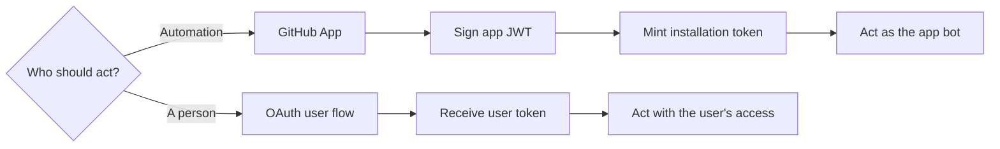
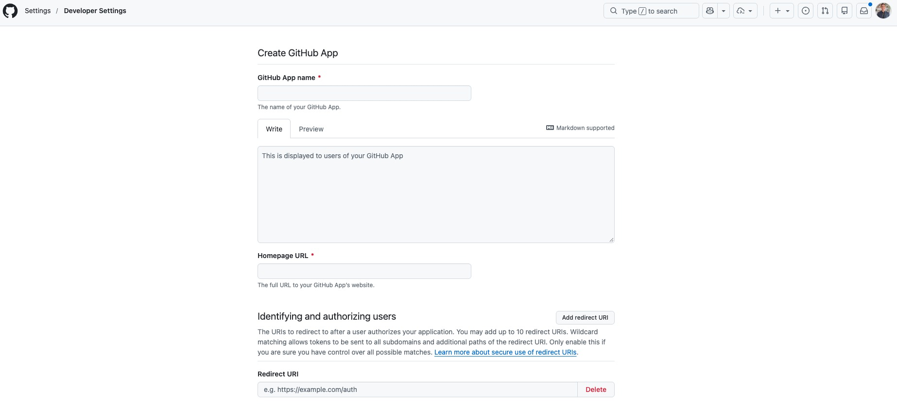
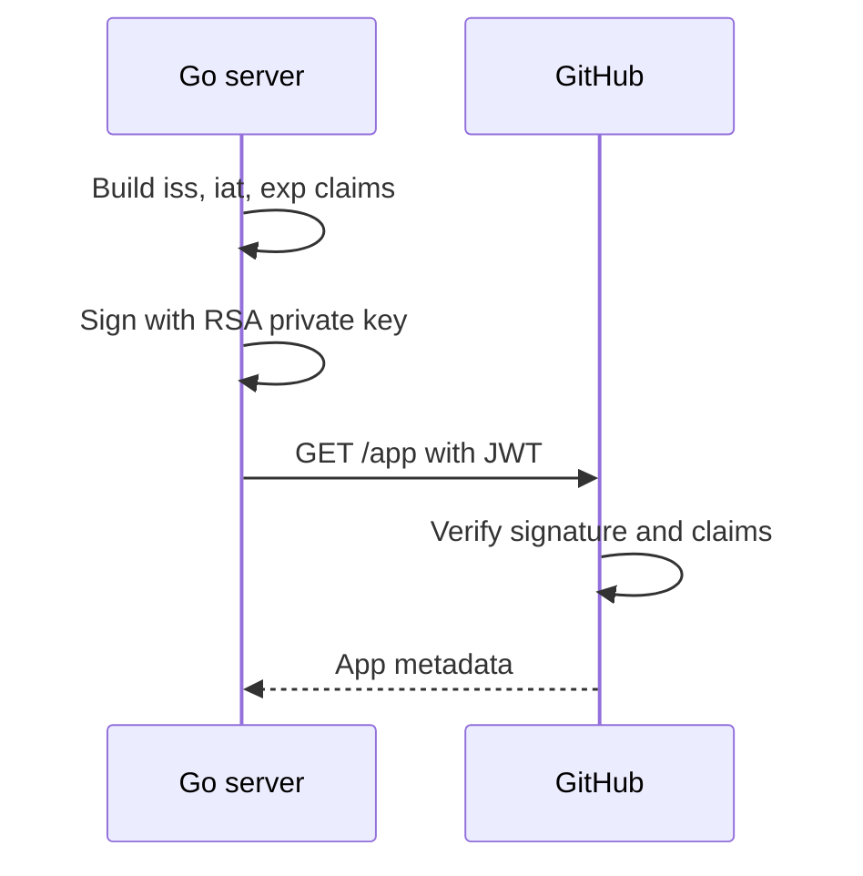
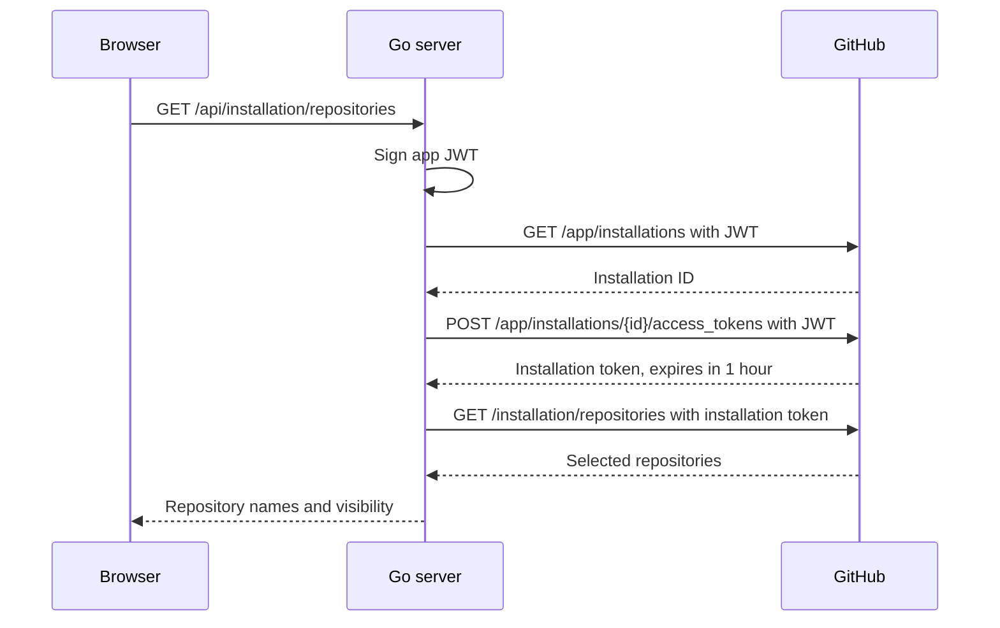
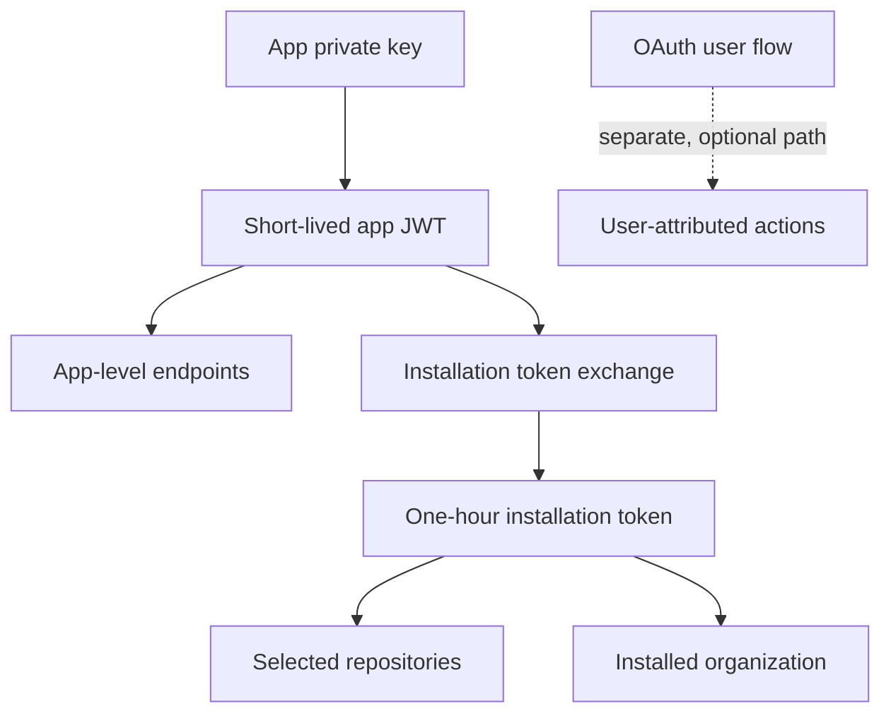

import { Code } from 'astro:components';
import goMod from './demo/go.mod?raw';
import mainGo from './demo/cmd/ghapp/main.go?raw';
import configGo from './demo/internal/githubapp/config.go?raw';
import jwtGo from './demo/internal/githubapp/jwt.go?raw';
import clientGo from './demo/internal/githubapp/client.go?raw';
import installationGo from './demo/internal/githubapp/installation.go?raw';
import organizationGo from './demo/internal/githubapp/organization.go?raw';
import middlewareGo from './demo/internal/githubapp/middleware.go?raw';
import helpersGo from './demo/internal/githubapp/helpers.go?raw';
import appGo from './demo/internal/githubapp/app.go?raw';
import routesGo from './demo/internal/githubapp/routes.go?raw';
import launchJSON from './demo/.vscode/launch.json?raw';
import indexHTML from './demo/static/index.html?raw';
import appJS from './demo/static/app.js?raw';

GitHub provides several ways to authenticate API requests. This workshop focuses on GitHub Apps: applications that receive controlled access to selected repositories and organizations through their own bot identity.

A traditional OAuth flow produces a user token. That token inherits the user's access, rate limit, and lifecycle. A GitHub App installation token represents the installed app. It keeps working when the installer leaves, can be limited to selected repositories, and attributes API activity to the app bot.

This workshop implements the GitHub App path. OAuth stays in the comparison because the identity choice affects permissions and attribution.

## GitHub App or OAuth?



| Concern | GitHub App installation | Traditional OAuth flow |
|---|---|---|
| Identity | The app bot | The authorizing user |
| Initial authorization | Owner installs the app | Each user authorizes the app |
| Repository access | Only repositories selected during installation | Repositories available to the user and requested scopes |
| Permissions | Fine-grained read/write permissions | Broader OAuth scopes |
| Lifecycle | Independent of the installing user | Changes when the user loses or revokes access |
| Token lifetime | Installation token expires after one hour | User-token lifecycle must be managed |
| Rate limits | Scale with installation size | Consume the user's rate limit |
| Best fit | Bots, CI, repository and organization automation | User-attributed actions and user-specific data |

A GitHub App can also ask a user to sign in and issue a user access token. Use that token when GitHub must apply the signed-in user's permissions or attribute the action to that user. Examples include showing their notifications or creating a comment on their behalf. This workshop uses installation tokens, so its API calls are made by the app bot.

## What you will build

1. Register a GitHub App with minimal permissions.
2. Sign a short-lived JWT that proves the app's identity.
3. Exchange that JWT for an installation token.
4. Read app metadata, organization metadata, and accessible repositories.
5. Display the results in a small browser console while credentials remain on the server.

The credential chain has two links:

| Credential | Purpose | Lifetime |
|---|---|---|
| App JWT | Authenticate the GitHub App to app-level endpoints | At most 10 minutes |
| Installation token | Access resources granted to one installation | 1 hour |

The private key, JWT, and installation token remain on the Go server. The browser receives display data only.

## Before you start

You need Go 1.26 or newer, a GitHub account, a browser, and two terminals. Expect about 35 to 45 minutes from an empty folder to the running dashboard.

For the organization panel, install the app on an organization and set `GITHUB_ORG`. Personal-account installations can leave `GITHUB_ORG` empty. The app metadata and repository panels will still work.

## Checkpoint 1: register the app

**Win condition:** the app is installed and its private key is ignored by git.

### Step 1: create the project

```bash
mkdir ghappworkshop
cd ghappworkshop
git init

go mod init ghappworkshop
go get github.com/golang-jwt/jwt/v5@v5.3.0
go get github.com/joho/godotenv@v1.5.1

mkdir -p cmd/ghapp internal/githubapp static data .vscode

touch .gitignore .env .env.example data/.gitkeep \
  cmd/ghapp/main.go \
  internal/githubapp/app.go \
  internal/githubapp/client.go \
  internal/githubapp/config.go \
  internal/githubapp/helpers.go \
  internal/githubapp/installation.go \
  internal/githubapp/jwt.go \
  internal/githubapp/middleware.go \
  internal/githubapp/organization.go \
  internal/githubapp/routes.go \
  .vscode/launch.json \
  static/index.html static/app.js
```

<Code code={goMod} lang="go" />

Write `.gitignore` before downloading the private key:

```text
.env
*.pem
data/*
!data/.gitkeep
```

Fill `.env.example`:

```text
# Copy this file to .env and fill in values from the GitHub App settings.
GITHUB_CLIENT_ID=
GITHUB_PRIVATE_KEY_PATH=./data/your-app.private-key.pem

# Required for the organization card.
GITHUB_ORG=

# Optional: debug, info, warn, or error.
LOG_LEVEL=info
```

Then create the ignored local file:

```bash
cp .env.example .env
```

### Step 2: create and install the GitHub App



Open **Settings → Developer settings → GitHub Apps → New GitHub App**.

**Basic settings**

1. Give the app a unique name, such as `installation-token-workshop-yourname`.
2. Set **Homepage URL** to `http://localhost:8080`.
3. Leave the callback URL blank. User authorization is outside this workshop.
4. Leave **Request user authorization during installation** unchecked.
5. Leave Device Flow disabled.

**Webhooks**

Disable **Active** for this local workshop. Production apps should use installation webhooks; we return to that later.

**Permissions**

Keep the default **Metadata: read-only** repository permission. It covers the three read-only endpoints used here. Add permissions when the app has a concrete use for them.

Create the app, then:

1. Copy its **Client ID** into `.env`.
2. Generate a private key.
3. Move the downloaded `.pem` file into `data/` and update `GITHUB_PRIVATE_KEY_PATH`.
4. Install the app on an organization (or personal account).
5. Choose one or two repositories. Repository selection is one of the GitHub App model's main benefits.
6. Put the organization login in `GITHUB_ORG`. Personal-account installations can leave it blank; the organization panel will report that configuration is required.

This setup uses a client ID and private key. Client secrets are used by the optional user OAuth flow.

### Verify Checkpoint 1

```bash
git check-ignore .env data/*.pem
```

**Expected:** the command prints `.env` and the private-key path. The app also appears under the organization's installed GitHub Apps with the repositories you selected.

## Checkpoint 2: build the installation-token server

**Win condition:** three local API routes return app, organization, and repository data using the app identity.

### Step 3: load configuration

Fill `internal/githubapp/config.go`.

The server needs three GitHub values:

- the client ID used as the JWT issuer;
- the RSA private key used to sign the JWT;
- the organization used to select an installation.

Process environment variables take precedence over values in `.env`. Production configuration can replace the local file.

<Code code={configGo} lang="go" />

### Step 4: sign the app JWT

Fill `internal/githubapp/jwt.go`.

The JWT proves the app's identity and works with app-level endpoints. Repository endpoints require an installation token. The JWT carries three claims:

- `iss`: the app's client ID;
- `iat`: 60 seconds in the past to tolerate clock drift;
- `exp`: nine minutes ahead, inside GitHub's ten-minute maximum.

GitHub finds the app's public key from `iss` and verifies the `RS256` signature.



The parser accepts GitHub's PKCS#1 key and PKCS#8 RSA keys exported by other tools.

<Code code={jwtGo} lang="go" />

### Step 5: add the GitHub HTTP client

Fill `internal/githubapp/client.go`.

The wrapper pins the GitHub REST API version, adds the recommended media type, attaches the bearer token, limits response size, and applies a timeout. `APIError` contains the status, method, path, and response body. Request headers stay out of logs.

<Code code={clientGo} lang="go" />

### Step 6: create the application core

Fill `internal/githubapp/app.go`.

`App` holds the parsed private key, GitHub client, logger, installation ID, and cached installation tokens. The methods added in the next steps use this shared state through an `*App` receiver.

<Code code={appGo} lang="go" />

### Step 7: discover the installation and mint its token

Fill `internal/githubapp/installation.go`.

This file performs both authentication levels:

1. `getAppMetadata` sends the JWT directly to `GET /app`.
2. `installationID` sends the JWT to `GET /app/installations`.
3. `installationToken` exchanges the JWT for a one-hour installation token.
4. `listInstallationRepositories` uses the installation token.



The token is cached until five minutes before expiry. Never assume an installation token has a fixed length or format; treat it as opaque.

<Code code={installationGo} lang="go" />

### Step 8: read the organization

Fill `internal/githubapp/organization.go`.

The organization request uses the same installation token as the repository request. The response type contains the fields displayed by the UI.

<Code code={organizationGo} lang="go" />

### Step 9: wire the local server

Fill `internal/githubapp/helpers.go` with JSON response helpers.

<Code code={helpersGo} lang="go" />

Fill `internal/githubapp/middleware.go` with security and cache headers.

<Code code={middlewareGo} lang="go" />

Fill `internal/githubapp/routes.go`. It exposes three read-only routes:

| Route | GitHub credential used |
|---|---|
| `GET /api/app` | App JWT |
| `GET /api/organization` | Installation token |
| `GET /api/installation/repositories` | Installation token |

<Code code={routesGo} lang="go" />

Fill `cmd/ghapp/main.go` to load configuration and start the HTTP server with timeouts.

<Code code={mainGo} lang="go" />

Run it:

```bash
go mod tidy
gofmt -w cmd internal
go run ./cmd/ghapp
```

In another terminal:

```bash
curl -s http://localhost:8080/api/app
curl -s http://localhost:8080/api/organization
curl -s http://localhost:8080/api/installation/repositories
```

**Expected:** app metadata, the configured organization, and the repositories selected during installation. Authentication happens between the Go server and GitHub.

## Checkpoint 3: display the installation

**Win condition:** one page shows which app is running, which organization it targets, and which repositories the installation can access.

### Step 10: build the browser console

Fill `static/index.html` and `static/app.js`.

The browser calls your local server. The private key, JWT, and installation token remain on the server. Each panel names the credential used by the Go server.

<Code code={indexHTML} lang="html" />

<Code code={appJS} lang="js" />

### Verify Checkpoint 3

Restart the server and open [http://localhost:8080](http://localhost:8080).

Confirm three things:

1. **App metadata** shows the app name, owner, client ID, and permissions.
2. **Organization** shows the account configured by `GITHUB_ORG`.
3. **Accessible repositories** lists the repositories selected for the installation.

Select **Reload GitHub data**. The server may reuse its cached installation token. The token remains in server memory.

## Why this is better for automation

The GitHub App flow has a short credential chain. The server signs a JWT, mints an installation token, and caches it until shortly before expiry. This model gives automation five practical benefits:

1. **Least privilege:** owners choose repositories, and app permissions are split by resource and read/write level.
2. **Stable identity:** jobs run as the app bot and continue across personnel changes.
3. **Short-lived credentials:** installation tokens expire after one hour and can be minted again from the app identity.
4. **Clear revocation:** removing repositories or uninstalling the app removes access at the installation boundary.
5. **Operational scale:** installation rate limits scale with the number of repositories and organization users.

Features that enforce a signed-in user's permissions or attribute actions to that user require GitHub App user authorization. Treat that as a separate flow with its own tokens and sessions.

## Before production

This demo leaves its local read-only API routes unauthenticated. Any client that can reach the server can request data available to the installation. Put the application behind your authorization policy before deployment.

Production work:

1. Store the private key in a secret manager or sign through a key-management service.
2. Subscribe to `installation`, `installation_repositories`, and `installation_target` webhooks. Persist installation IDs from their payloads.
3. Verify webhook signatures and handle suspension, deletion, repository changes, and key rotation.
4. Share the installation-token cache across instances, and coordinate refreshes to avoid duplicate mints.
5. Add authorization, rate limiting, structured audit logs, timeouts, and retry handling around your own API.

Keep permissions narrow. Mint tokens for fewer repositories or fewer permissions when a job needs less access than the installation grants.

## Keep this mental model



The JWT identifies the app. The installation token defines where that installation may act. An OAuth user token identifies the person who authorized an action.

Primary references: [Differences between GitHub Apps and OAuth apps](https://docs.github.com/en/apps/oauth-apps/building-oauth-apps/differences-between-github-apps-and-oauth-apps), [Authenticating as a GitHub App](https://docs.github.com/en/apps/creating-github-apps/authenticating-with-a-github-app/authenticating-as-a-github-app), [Generating an installation access token](https://docs.github.com/en/apps/creating-github-apps/authenticating-with-a-github-app/generating-an-installation-access-token-for-a-github-app), and [Permissions required for GitHub Apps](https://docs.github.com/en/rest/authentication/permissions-required-for-github-apps).

## Debug with VS Code

Install the [Go extension for Visual Studio Code](https://marketplace.visualstudio.com/items?itemName=golang.Go), then open the workshop directory as the workspace:

```bash
code .
```

Fill `.vscode/launch.json`:

<Code code={launchJSON} lang="json" />

`program` points Delve at the main package. `cwd` keeps relative paths such as `./data/your-app.private-key.pem` anchored to the project root. `envFile` loads the same `.env` used by `go run`.

Set breakpoints at these locations:

1. `jwt.go`, inside `signAppJWT`, to inspect `iss`, `iat`, and `exp`.
2. `installation.go`, inside `getAppMetadata`, to follow a JWT-authenticated request.
3. `installation.go`, inside `installationID`, to inspect the installation selected for `GITHUB_ORG`.
4. `installation.go`, inside `installationToken`, to watch token minting and cache reuse.
5. `routes.go`, inside `handleRepositories`, to follow a browser request into the GitHub client.

Open **Run and Debug**, choose **Debug GitHub App**, and press F5. VS Code may offer to install or update Delve during the first run.

Trigger each path from another terminal:

```bash
curl -s http://localhost:8080/api/app
curl -s http://localhost:8080/api/installation/repositories
curl -s http://localhost:8080/api/installation/repositories
curl -s http://localhost:8080/api/organization
```

The first repository request discovers the installation and mints a token. The second repository request reaches the cache branches. Inspect `cachedInstallationID`, `installationTokens`, `appJWT`, and `minted.ExpiresAt` in the Variables panel. Use F10 to step over a line, F11 to enter a function, Shift+F11 to leave it, and F5 to continue.

The configuration follows the [VS Code Go debugging reference](https://github.com/golang/vscode-go/wiki/debugging).
