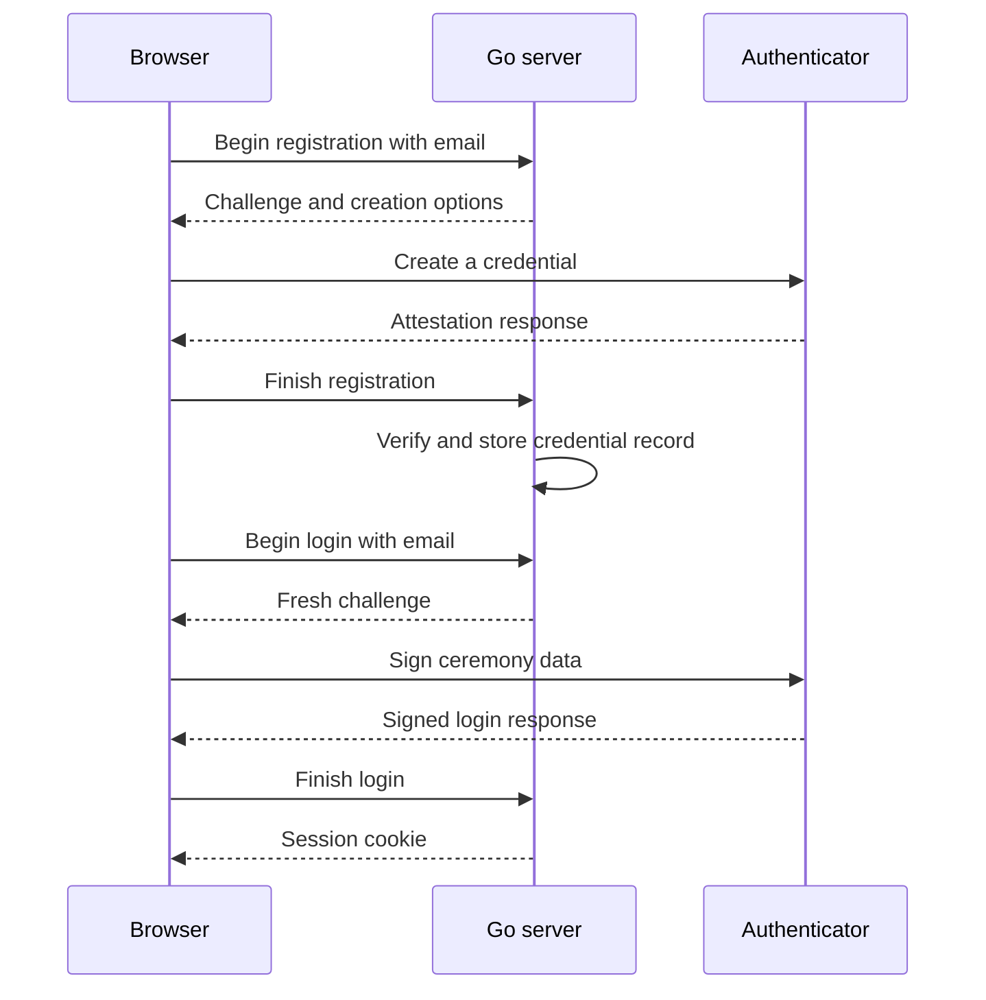
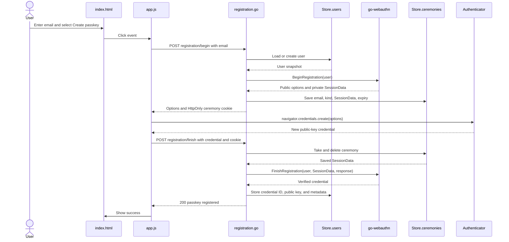

import { Code } from 'astro:components';
import goMod from './demo/go.mod?raw';
import mainGo from './demo/cmd/passkeyauth/main.go?raw';
import appGo from './demo/internal/auth/app.go?raw';
import storeGo from './demo/internal/auth/store.go?raw';
import helpersGo from './demo/internal/auth/helpers.go?raw';
import ceremonyGo from './demo/internal/auth/ceremony.go?raw';
import registrationGo from './demo/internal/auth/registration.go?raw';
import loginGo from './demo/internal/auth/login.go?raw';
import middlewareGo from './demo/internal/auth/middleware.go?raw';
import sessionGo from './demo/internal/auth/session.go?raw';
import appTestGo from './demo/internal/auth/app_test.go?raw';
import indexHTML from './demo/static/index.html?raw';
import appJS from './demo/static/app.js?raw';
import appTestJS from './demo/static/app.test.mjs?raw';

Passkeys let people sign in without a password. But a passkey is only the login proof. After login, most web applications still use a session cookie.

This workshop builds that complete path. A user will enter an email, create a passkey, sign in with it, receive a server-side session, and update a protected profile. We will also omit the CSRF token from one request and watch the server reject it.

We will build the application in three working checkpoints. Do not copy the final application at the start. At each checkpoint, every file either appears in full or is changed by an exact patch.

1. Register a passkey. Run it and prove registration works.
2. Add passkey login and a server-side session. Run it again.
3. Add a state-changing profile request, see why its session cookie is not enough, then add and test CSRF protection.

## A few words before we start

| Word | Plain meaning |
|---|---|
| Passkey | A WebAuthn credential backed by a public/private key pair. |
| Authenticator | The software or hardware that creates and uses the credential. Examples include Windows Hello, a phone, a security key, or a passkey provider. |
| Relying party (RP) | The website that accepts the credential. Here, it is our Go application. |
| Challenge | Random data created for one ceremony and accepted once. It prevents replay. |
| Ceremony | One complete registration or login exchange. |
| Credential | The server's record of a passkey: its ID, public key, and metadata. |
| Session | A server-side record that says a browser has signed in. |
| CSRF token | A secret bound to the session that another site cannot normally read or add to a request. |

The private key is never sent to our server. A synced passkey provider may move encrypted credential material between a user's devices, but the relying party receives only public credential data.

## What we will build

| Endpoint | Purpose |
|---|---|
| `POST /api/passkeys/registration/begin` | Create registration options and a challenge |
| `POST /api/passkeys/registration/finish` | Verify and store the public-key credential |
| `POST /api/passkeys/login/begin` | Create authentication options and a challenge |
| `POST /api/passkeys/login/finish` | Verify the signed login response and create a session |
| `GET /api/session` | Read the current user and CSRF token |
| `POST /api/profile` | Update a profile using the session and CSRF token |
| `POST /api/logout` | Revoke the session using the CSRF token |



The CSRF token is deliberately absent from this diagram. Authentication comes first. We will introduce CSRF only after the application has a cookie-authenticated, state-changing request.

The demo stores everything in memory. Restarting it erases users, credentials, ceremonies, and sessions.

It also treats the submitted email as already verified. That is acceptable only for this local workshop. A production service must verify mailbox ownership before creating the first passkey. Otherwise someone could claim another person's address.

## Requirements

You need:

- Go 1.26 or newer;
- a current browser with WebAuthn support;
- `localhost`, which browsers treat as a secure development context.

Production WebAuthn uses HTTPS. Production cookies also need the `Secure` flag. This demo uses HTTP and non-`Secure` cookies only on `localhost`.

## Step 1: Create the module

Start in an empty directory:

```bash
mkdir passkeyauth
cd passkeyauth
go mod init passkeyauth
go get github.com/go-webauthn/webauthn@v0.18.1
mkdir -p cmd/passkeyauth internal/auth static
touch cmd/passkeyauth/main.go \
  internal/auth/app.go \
  internal/auth/store.go \
  internal/auth/helpers.go \
  internal/auth/ceremony.go \
  internal/auth/registration.go \
  static/index.html static/app.js
```

`go-webauthn` parses authenticator data and verifies WebAuthn ceremonies. We pin version `v0.18.1` because the module is still pre-1.0.

Your `go.mod` will contain the direct dependency below. `go mod tidy` will add its indirect dependencies later. Go generates `go.sum`; do not write that file by hand.

<Code code={goMod} lang="go" />

The project will end with this shape:

```text
passkeyauth/
├── go.mod
├── go.sum
├── cmd/passkeyauth/main.go
├── internal/auth/
│   ├── app.go
│   ├── app_test.go
│   ├── ceremony.go
│   ├── helpers.go
│   ├── login.go
│   ├── middleware.go
│   ├── registration.go
│   ├── session.go
│   └── store.go
└── static/
    ├── app.test.mjs
    ├── app.js
    └── index.html
```

## Checkpoint 1: register a passkey

The first application does one job: registration. It has no login route, session type, profile, logout, or CSRF token.

## Step 2: Create the registration data model

Create `internal/auth/store.go` with this first version:

The `User` type implements the four methods required by `webauthn.User`. `WebAuthnID` returns a random, stable user handle. We do not use the email because an email can change and contains identifying information. The server treats this handle as a random identifier with no meaning. It is not a password or secret.

`Credentials` contains the records returned after successful registration. Each record has a credential ID, public key, authenticator state, flags, and metadata. It never contains the private key.

`Ceremony` exists only between a WebAuthn begin request and finish request. It is temporary WebAuthn state, not a login session.

The store returns user copies so handlers do not read a mutable user while another request updates it. It also checks credential IDs across every account before saving a first credential.

```go
package auth

import (
    "bytes"
    "errors"
    "sync"
    "time"

    "github.com/go-webauthn/webauthn/webauthn"
)

type User struct {
    ID          []byte
    Email       string
    Credentials []webauthn.Credential
}

func (u *User) WebAuthnID() []byte                         { return u.ID }
func (u *User) WebAuthnName() string                       { return u.Email }
func (u *User) WebAuthnDisplayName() string                { return u.Email }
func (u *User) WebAuthnCredentials() []webauthn.Credential { return u.Credentials }

type Ceremony struct {
    Email     string
    Kind      string
    Data      webauthn.SessionData
    ExpiresAt time.Time
}

type Store struct {
    mu         sync.RWMutex
    users      map[string]*User
    ceremonies map[string]Ceremony
}

func newStore() *Store {
    return &Store{
        users:      make(map[string]*User),
        ceremonies: make(map[string]Ceremony),
    }
}

func cloneUser(user *User) *User {
    if user == nil {
        return nil
    }
    copy := *user
    copy.ID = bytes.Clone(user.ID)
    copy.Credentials = append([]webauthn.Credential(nil), user.Credentials...)
    return &copy
}

func (s *Store) userByEmail(email string) *User {
    s.mu.RLock()
    defer s.mu.RUnlock()
    return cloneUser(s.users[email])
}

func (s *Store) userForRegistration(email string) (*User, error) {
    s.mu.Lock()
    defer s.mu.Unlock()

    user := s.users[email]
    if user == nil {
        user = &User{ID: randomBytes(32), Email: email}
        s.users[email] = user
    }
    if len(user.Credentials) > 0 {
        return nil, errors.New("this workshop account already has a passkey")
    }
    return cloneUser(user), nil
}

func (s *Store) addFirstCredential(email string, credential webauthn.Credential) error {
    s.mu.Lock()
    defer s.mu.Unlock()

    user := s.users[email]
    if user == nil {
        return errors.New("registration expired")
    }
    if len(user.Credentials) > 0 {
        return errors.New("this workshop account already has a passkey")
    }
    for _, otherUser := range s.users {
        for _, existing := range otherUser.Credentials {
            if bytes.Equal(existing.ID, credential.ID) {
                return errors.New("credential is already registered")
            }
        }
    }
    user.Credentials = append(user.Credentials, credential)
    return nil
}
```

`cloneUser` creates a snapshot while the lock is held. A handler can safely use that snapshot after the store unlocks. Without the copy, another request could mutate the credential slice while WebAuthn reads it.

## Step 3: Add the HTTP helpers

Create `internal/auth/helpers.go`.

This file reads the email, checks the JSON media type, generates random bytes with `crypto/rand`, and writes JSON responses. It also builds the credential summary that the workshop prints after registration and login. The email validation is intentionally light. Production signup normally needs a stronger email policy plus mailbox verification.

The exact media-type check matters. A prefix check would accidentally accept values such as `application/jsonp`.

<Code code={helpersGo} lang="go" />

## Step 4: Configure registration routes

Create `internal/auth/app.go`. This version exposes only registration and static files.

These settings tell the browser and library which website may use the passkey:

- `RPID` is the domain scope of the credential. It has no scheme or port.
- `RPOrigins` contains the allowed web origins, including scheme and port.
- `ResidentKeyRequirementRequired` requests a discoverable credential, commonly called a passkey.
- `VerificationRequired` requests local user verification, such as a device PIN or fingerprint. Biometric data is not sent to our server.
- `PreferNoAttestation` avoids requesting identifying authenticator information. We still receive the credential data needed for authentication.

The routes use Go's method-aware `ServeMux` patterns.

```go
package auth

import (
    "net/http"
    "time"

    "github.com/go-webauthn/webauthn/protocol"
    "github.com/go-webauthn/webauthn/webauthn"
)

const (
    ceremonyCookie = "passkey_ceremony"
    ceremonyTTL    = 5 * time.Minute
)

type Config struct {
    RPDisplayName string
    RPID          string
    RPOrigins     []string
    StaticDir     string
}

type App struct {
    webAuthn  *webauthn.WebAuthn
    store     *Store
    staticDir string
}

func New(cfg Config) (*App, error) {
    web, err := webauthn.New(&webauthn.Config{
        RPDisplayName:         cfg.RPDisplayName,
        RPID:                  cfg.RPID,
        RPOrigins:             cfg.RPOrigins,
        AttestationPreference: protocol.PreferNoAttestation,
        AuthenticatorSelection: protocol.AuthenticatorSelection{
            ResidentKey:      protocol.ResidentKeyRequirementRequired,
            UserVerification: protocol.VerificationRequired,
        },
    })
    if err != nil {
        return nil, err
    }
    if cfg.StaticDir == "" {
        cfg.StaticDir = "static"
    }
    return &App{webAuthn: web, store: newStore(), staticDir: cfg.StaticDir}, nil
}

func (a *App) Routes() http.Handler {
    mux := http.NewServeMux()
    mux.HandleFunc("POST /api/passkeys/registration/begin", a.beginRegistration)
    mux.HandleFunc("POST /api/passkeys/registration/finish", a.finishRegistration)
    mux.Handle("/", http.FileServer(http.Dir(a.staticDir)))
    return mux
}
```

## Step 5: Store one-use WebAuthn ceremonies

Create `internal/auth/ceremony.go`.

Registration and login each have a begin request and a finish request. The server must remember what it sent between those requests. `webauthn.SessionData` contains the challenge, RP ID, user ID, allowed credential IDs, user-verification policy, and other verification inputs.

We store that complete value on the server. The browser receives only a random lookup ID in an `HttpOnly` cookie. The cookie is also `SameSite=Strict` and limited to `/api/passkeys/`.

`takeCeremony` deletes the record before verification. The response cannot be replayed after either success or failure. It also checks the ceremony kind and our five-minute expiry.

This demo keeps abandoned ceremonies until restart. A production store needs periodic expiry cleanup.

<Code code={ceremonyGo} lang="go" />

## Step 6: Register the passkey

Create `internal/auth/registration.go` after reading this section.

Registration needs two HTTP requests. The server must create a fresh challenge before the authenticator creates a credential. The browser therefore talks to the server, then the authenticator, then the server again.

### Begin registration

`beginRegistration` performs these steps:

1. Require `application/json`.
2. Normalize and validate the email.
3. Load or create a workshop user with a random 32-byte handle.
4. Refuse a second credential because this workshop supports one passkey per account.
5. Call `BeginRegistration`.
6. Store the returned ceremony data.
7. Return the public creation options.

`BeginRegistration` returns two different values. `options` goes to the browser. `data` stays on the server.

The options contain the challenge, relying-party information, user information, accepted algorithms, timeout, and authenticator preferences. The exclusion list identifies credentials already registered for this account. The browser and authenticator use it to avoid creating a duplicate credential. The database still needs its own uniqueness check.

### What happens inside registration

The browser passes the options to `navigator.credentials.create()`. Then:

1. The browser checks that the RP ID is valid for the page's origin.
2. The authenticator asks for user consent and local user verification.
3. The authenticator creates a new public/private key pair.
4. The authenticator or passkey provider keeps the private key. It is not sent to our server.
5. The authenticator creates authenticator data containing an RP ID hash, flags, and the new credential data.
6. The browser returns an attestation object and client data.

The client data contains the ceremony type, challenge, and origin. The attestation object contains authenticator data and may contain an attestation statement, depending on policy.

Local user verification means the authenticator was unlocked according to its policy. It does not establish the person's legal identity or prove ownership of the submitted email address.

### Finish registration

`finishRegistration` removes the saved ceremony and calls `FinishRegistration`. The library checks the ceremony type, challenge, origin, RP ID hash, authenticator data, user-presence and user-verification flags, public-key algorithm, and attestation policy.

Only then does `addFirstCredential` save the credential. Never store a public key merely because a browser sent one.

For this workshop, the JSON response includes a summary of the stored credential. It shows the credential ID, public key, attestation details, transports, verification and backup flags, signature counter, and clone warning. Binary values use Base64URL so JSON can carry them.

The credential ID and public key are not secrets. The private key never reaches the server. Even so, a production response should normally contain only the data the page needs, such as `{ "message": "passkey registered" }`. Returning the full summary exposes implementation details and may make it easier to identify a specific authenticator or credential.

<Code code={registrationGo} lang="go" />

## Step 7: Add the registration page

Create `static/index.html`:

```html
<!doctype html>
<html lang="en">
  <head>
    <meta charset="utf-8" />
    <meta name="viewport" content="width=device-width, initial-scale=1" />
    <title>Passkey workshop</title>
  </head>
  <body>
    <h1>Register a passkey</h1>
    <label>Email <input id="email" type="email" autocomplete="off" data-1p-ignore data-bwignore="true" /></label>
    <button id="register" type="button">Create passkey</button>
    <pre id="status">Ready.</pre>
    <script src="/app.js" defer></script>
  </body>
</html>
```

Create `static/app.js`. WebAuthn uses binary values, while JSON carries text. These helpers convert the challenge, user ID, credential ID, client data, and attestation object to and from Base64URL.

`autocomplete="off"` asks the browser not to fill the email. `data-1p-ignore` and `data-bwignore="true"` ask the 1Password and Bitwarden extensions to ignore the field. These attributes affect form filling only. They cannot stop an extension from replacing the browser's WebAuthn prompt when `navigator.credentials.create()` runs. To prevent that prompt during the workshop, disable passkey saving in the extension or exclude `localhost` in the extension settings.

```js
const statusBox = document.querySelector("#status");
const emailInput = document.querySelector("#email");

function show(value) {
  statusBox.textContent = typeof value === "string" ? value : JSON.stringify(value, null, 2);
}

function decodeBase64URL(value) {
  const base64 = value.replaceAll("-", "+").replaceAll("_", "/");
  const padded = base64.padEnd(Math.ceil(base64.length / 4) * 4, "=");
  return Uint8Array.from(atob(padded), (character) => character.charCodeAt(0));
}

function encodeBase64URL(value) {
  const bytes = new Uint8Array(value);
  let binary = "";
  for (const byte of bytes) binary += String.fromCharCode(byte);
  return btoa(binary).replaceAll("+", "-").replaceAll("/", "_").replaceAll("=", "");
}

function creationOptionsFromJSON(options) {
  options.challenge = decodeBase64URL(options.challenge);
  options.user.id = decodeBase64URL(options.user.id);
  options.excludeCredentials = (options.excludeCredentials || []).map((credential) => ({
    ...credential,
    id: decodeBase64URL(credential.id),
  }));
  return options;
}

function credentialToJSON(credential) {
  return {
    id: credential.id,
    rawId: encodeBase64URL(credential.rawId),
    type: credential.type,
    authenticatorAttachment: credential.authenticatorAttachment,
    clientExtensionResults: credential.getClientExtensionResults(),
    response: {
      clientDataJSON: encodeBase64URL(credential.response.clientDataJSON),
      attestationObject: encodeBase64URL(credential.response.attestationObject),
      transports: credential.response.getTransports?.() || [],
    },
  };
}

async function api(path, options) {
  const response = await fetch(path, options);
  const body = await response.json();
  if (!response.ok) throw new Error(`${response.status}: ${body.error}`);
  return body;
}

document.querySelector("#register").addEventListener("click", async () => {
  try {
    show("Starting registration…");
    const creation = await api("/api/passkeys/registration/begin", {
      method: "POST",
      headers: { "Content-Type": "application/json" },
      body: JSON.stringify({ email: emailInput.value }),
    });
    const credential = await navigator.credentials.create({
      publicKey: creationOptionsFromJSON(creation.publicKey),
    });
    show(await api("/api/passkeys/registration/finish", {
      method: "POST",
      headers: { "Content-Type": "application/json" },
      body: JSON.stringify(credentialToJSON(credential)),
    }));
  } catch (error) {
    show(error.message);
  }
});
```

Create `cmd/passkeyauth/main.go`:

<Code code={mainGo} lang="go" />

Format and run this first checkpoint:

```bash
go mod tidy
gofmt -w cmd internal
go run ./cmd/passkeyauth
```

Open [http://localhost:8080](http://localhost:8080), enter an email, and select **Create passkey**. After approving the authenticator prompt, expect `passkey registered`.

Stop here until registration works. At this point the server has a verified public-key credential, but it has no way to log in and no session.

> **Why does registration not sign us in?** Checkpoint 1 has not introduced sessions yet, so registration stops after saving the credential. Most production signup flows create a session after `FinishRegistration` verifies the new passkey. That lets the user create a passkey and continue as a signed-in user without a second passkey prompt. Verify the email address before creating that account and session. This workshop accepts any email only to keep the local example focused.

## How registration moves through the application

Before adding login, follow the registration checkpoint from top to bottom. `Store.users` and `Store.ceremonies` are shown separately because they have different jobs, although both are maps inside the same in-memory `Store`.



The important split is between public and private ceremony data. The browser receives the public creation options. The server keeps `SessionData`, including the expected challenge, and gives the browser only a random cookie that identifies that saved ceremony. During the finish request, the server consumes that ceremony before verifying and storing the credential.

## Checkpoint 2: add login and a session

Login will verify a fresh signature and exchange it for a normal application session. We still will not add profile updates or CSRF.

Create the files used by this checkpoint:

```bash
touch internal/auth/login.go internal/auth/middleware.go internal/auth/session.go
```

## Step 8: Expand the store for login

Add a session cookie name and lifetime to the constants in `app.go`:

```diff
 const (
     ceremonyCookie = "passkey_ceremony"
+    sessionCookie  = "session"
     ceremonyTTL    = 5 * time.Minute
+    sessionTTL     = 24 * time.Hour
 )
```

Add `Session` and the `sessions` map to `store.go`:

```diff
+type Session struct {
+    Email     string
+    ExpiresAt time.Time
+}
+
 type Store struct {
     mu         sync.RWMutex
     users      map[string]*User
     ceremonies map[string]Ceremony
+    sessions   map[string]Session
 }

 func newStore() *Store {
     return &Store{
         users:      make(map[string]*User),
         ceremonies: make(map[string]Ceremony),
+        sessions:   make(map[string]Session),
     }
 }
```

Also add this method to `store.go`. `FinishLogin` does more than verify the signature. It returns the credential with its latest login state.

Some authenticators increase `SignCount` each time they use a passkey. The library compares the new count with the stored count. It saves the higher count, or sets `CloneWarning` when the count should have increased but did not. This warning means the passkey may have been copied. The library can also remember that the authenticator verified the user and whether a synced passkey is currently backed up.

We replace the stored credential with this returned value so the next login uses the latest state. If we kept the old value, the next login would compare against an old counter and could produce the wrong clone warning.

```go
func (s *Store) replaceCredential(email string, credential webauthn.Credential) bool {
    s.mu.Lock()
    defer s.mu.Unlock()

    user := s.users[email]
    if user == nil {
        return false
    }
    for i := range user.Credentials {
        if bytes.Equal(user.Credentials[i].ID, credential.ID) {
            user.Credentials[i] = credential
            return true
        }
    }
    return false
}
```

## Step 9: Sign in with the passkey

Create `internal/auth/login.go`.

Login has the same begin/finish shape.

`beginLogin` uses the email to load the account and its credentials. `BeginLogin` creates a fresh challenge and puts the user's credential IDs in `allowCredentials`.

The browser will pass those options to `navigator.credentials.get()`. The authenticator uses the private key to sign the authenticator data and a hash of the client data. It does not send the private key.

`finishLogin` calls `FinishLogin`. The library verifies the challenge, origin, RP ID, credential ownership, user-verification policy, and signature. The server deletes the ceremony before verification, so the same signed response cannot be submitted again.

The returned credential may contain an updated signature counter, clone warning, user-verification state, or backup state. We replace the stored credential before creating the application session. The workshop returns the same credential summary in the login response so you can compare it with the registration response.

The handler returns the same error when an email is missing or has no passkey. This makes it harder to test which email addresses have accounts. Timing and response details can still reveal that information, so production systems also need rate limits and the protections described by the WebAuthn specification.

<Code code={loginGo} lang="go" />

## Step 10: Create and read a session

Create `internal/auth/middleware.go` with session handling only:

```go
package auth

import (
    "net/http"
    "strings"
    "time"
)

type sessionHandler func(http.ResponseWriter, *http.Request, Session)

func (a *App) requireSession(next sessionHandler) http.HandlerFunc {
    return func(w http.ResponseWriter, r *http.Request) {
        cookie, err := r.Cookie(sessionCookie)
        if err != nil {
            writeError(w, http.StatusUnauthorized, "sign in first")
            return
        }

        a.store.mu.RLock()
        session, ok := a.store.sessions[cookie.Value]
        a.store.mu.RUnlock()
        if !ok || time.Now().After(session.ExpiresAt) {
            writeError(w, http.StatusUnauthorized, "session is missing or expired")
            return
        }
        next(w, r, session)
    }
}

func securityHeaders(next http.Handler) http.Handler {
    return http.HandlerFunc(func(w http.ResponseWriter, r *http.Request) {
        w.Header().Set("Content-Security-Policy", "default-src 'self'; script-src 'self'; style-src 'self' 'unsafe-inline'; base-uri 'none'; frame-ancestors 'none'")
        w.Header().Set("X-Content-Type-Options", "nosniff")
        if strings.HasPrefix(r.URL.Path, "/api/") {
            w.Header().Set("Cache-Control", "no-store")
        }
        next.ServeHTTP(w, r)
    })
}
```

Create `internal/auth/session.go`:

```go
package auth

import (
    "net/http"
    "time"
)

func (a *App) getSession(w http.ResponseWriter, _ *http.Request, session Session) {
    writeJSON(w, http.StatusOK, map[string]string{"email": session.Email})
}

func (a *App) createSession(email string) (string, Session) {
    token := randomToken(32)
    session := Session{Email: email, ExpiresAt: time.Now().Add(sessionTTL)}
    a.store.mu.Lock()
    a.store.sessions[token] = session
    a.store.mu.Unlock()
    return token, session
}
```

The random session ID is stored in an `HttpOnly` cookie by `finishLogin`. The browser sends that cookie automatically. JavaScript cannot read it. The actual session record stays on the server.

Add the login and session routes to `Routes` in `app.go`, and wrap the mux with the security headers:

```diff
 mux.HandleFunc("POST /api/passkeys/registration/finish", a.finishRegistration)
+mux.HandleFunc("POST /api/passkeys/login/begin", a.beginLogin)
+mux.HandleFunc("POST /api/passkeys/login/finish", a.finishLogin)
+mux.HandleFunc("GET /api/session", a.requireSession(a.getSession))
 mux.Handle("/", http.FileServer(http.Dir(a.staticDir)))
-return mux
+return securityHeaders(mux)
```

## Step 11: Expand the browser for login

Add these buttons after the registration button in `static/index.html`:

```html
<button id="login" type="button">Sign in with passkey</button>
<button id="load-session" type="button">Load session</button>
```

In `static/app.js`, add the conversion for login options:

```js
function requestOptionsFromJSON(options) {
  options.challenge = decodeBase64URL(options.challenge);
  options.allowCredentials = (options.allowCredentials || []).map((credential) => ({
    ...credential,
    id: decodeBase64URL(credential.id),
  }));
  return options;
}
```

Replace `credentialToJSON` with this expanded version. Registration responses contain an attestation object. Login responses contain authenticator data and a signature.

```js
function credentialToJSON(credential) {
  const response = {
    clientDataJSON: encodeBase64URL(credential.response.clientDataJSON),
  };
  if (credential.response.attestationObject) {
    response.attestationObject = encodeBase64URL(credential.response.attestationObject);
    response.transports = credential.response.getTransports?.() || [];
  } else {
    response.authenticatorData = encodeBase64URL(credential.response.authenticatorData);
    response.signature = encodeBase64URL(credential.response.signature);
    response.userHandle = credential.response.userHandle
      ? encodeBase64URL(credential.response.userHandle)
      : null;
  }
  return {
    id: credential.id,
    rawId: encodeBase64URL(credential.rawId),
    type: credential.type,
    authenticatorAttachment: credential.authenticatorAttachment,
    clientExtensionResults: credential.getClientExtensionResults(),
    response,
  };
}
```

Give `api` a default options value, then add the two button handlers:

```diff
-async function api(path, options) {
+async function api(path, options = {}) {
```

```js
document.querySelector("#login").addEventListener("click", async () => {
  try {
    show("Starting sign-in…");
    const request = await api("/api/passkeys/login/begin", {
      method: "POST",
      headers: { "Content-Type": "application/json" },
      body: JSON.stringify({ email: emailInput.value }),
    });
    const credential = await navigator.credentials.get({
      publicKey: requestOptionsFromJSON(request.publicKey),
    });
    show(await api("/api/passkeys/login/finish", {
      method: "POST",
      headers: { "Content-Type": "application/json" },
      body: JSON.stringify(credentialToJSON(credential)),
    }));
  } catch (error) {
    show(error.message);
  }
});

document.querySelector("#load-session").addEventListener("click", async () => {
  try {
    show(await api("/api/session"));
  } catch (error) {
    show(error.message);
  }
});
```

Restart the server. Register, sign in, then select **Load session**. It should return your email. That proves this chain:

```text
verified passkey signature -> random session ID -> HttpOnly cookie -> server-side session
```

There is still no CSRF token because every authenticated endpoint is read-only.

## Checkpoint 3: add a state change, then CSRF

Next, we'll add a profile update endpoint. It changes data and uses the session cookie, so it needs CSRF protection.

## Step 12: See the cookie problem

After sign-in, the browser automatically sends the session cookie with requests to this site. JavaScript does not need to read the cookie first. This means a request may act as the signed-in user even when another page caused it.

Passkeys do not change this. The passkey authenticated the login ceremony. Later profile requests use the cookie, not the passkey.

`SameSite=Lax`, strict JSON content types, and restrictive CORS already stop many cross-site requests. However, each protection covers different request types. We will make every state-changing handler check a CSRF token as well.

The initial registration and login routes do not use an authenticated session to change an existing account, so this workshop does not put a CSRF token on them. Their temporary ceremony cookie is `SameSite=Strict`, short-lived, and consumed once. An authenticated **add another passkey** route would need CSRF protection.

First imagine this incomplete route:

```go
mux.HandleFunc("POST /api/profile", a.requireSession(a.updateProfile))
```

This route checks only whether the request has a valid session cookie. It does not check whether our page intentionally sent the request. We need a second check for that.

## Step 13: Add the CSRF token

We will store a CSRF token in each server-side session. This approach is often called the synchronizer-token pattern:

1. Create a random CSRF token with the session.
2. Keep it in the server-side session.
3. Return it from `GET /api/session`.
4. Send it in `X-CSRF-Token` for state-changing requests.
5. Compare it on the server before running the handler.

The session ID and CSRF token are independent. The session ID remains in the `HttpOnly` cookie. JavaScript receives only the CSRF token.

Now replace the growing files with their final versions. At this point it is useful to see each whole file again; these are the versions that remain in the finished project.

### Final `internal/auth/store.go`

Add `ProfileName`, `CSRFToken`, and the profile update method to `store.go`:

```diff
 type User struct {
     ID          []byte
     Email       string
+    ProfileName string
     Credentials []webauthn.Credential
 }

 type Session struct {
     Email     string
+    CSRFToken string
     ExpiresAt time.Time
 }

 func (s *Store) userForRegistration(email string) (*User, error) {
     // ...
     if user == nil {
-        user = &User{ID: randomBytes(32), Email: email}
+        user = &User{ID: randomBytes(32), Email: email, ProfileName: email}
         s.users[email] = user
     }
     // ...
 }

+func (s *Store) updateProfileName(email, profileName string) bool {
+    s.mu.Lock()
+    defer s.mu.Unlock()
+
+    user := s.users[email]
+    if user == nil {
+        return false
+    }
+    user.ProfileName = profileName
+    return true
+}
```

Now replace `store.go` with the complete version:

<Code code={storeGo} lang="go" />

### Final `internal/auth/app.go`

Both state-changing routes require the session and the CSRF token. Logout needs protection too because it changes server state.

```diff
 mux.HandleFunc("GET /api/session", a.requireSession(a.getSession))
+mux.HandleFunc("POST /api/profile", a.requireSession(a.requireCSRF(a.updateProfile)))
+mux.HandleFunc("POST /api/logout", a.requireSession(a.requireCSRF(a.logout)))
 mux.Handle("/", http.FileServer(http.Dir(a.staticDir)))
```

Now replace `app.go` with the complete version:

<Code code={appGo} lang="go" />

### Final `internal/auth/middleware.go`

`requireCSRF` uses a constant-time comparison and rejects an empty, wrong, or missing token.

<Code code={middlewareGo} lang="go" />

### Final `internal/auth/session.go`

`createSession` now generates the second random value. `getSession` returns it after session authentication.

<Code code={sessionGo} lang="go" />

### Final browser files

Replace `static/index.html`:

<Code code={indexHTML} lang="html" />

Replace `static/app.js`:

<Code code={appJS} lang="js" />

After login, the script loads the session and stores its CSRF token only in memory. The **Load session** button can load it again. **Try without CSRF token** deliberately omits the header. **Save with CSRF token** sends it.

## Step 14: Prove that CSRF protection works

Create `internal/auth/app_test.go`.

The main table sends four profile updates:

| Request | Expected result |
|---|---|
| No session cookie | `401 Unauthorized` |
| Valid session, no CSRF token | `403 Forbidden` |
| Valid session, wrong CSRF token | `403 Forbidden` |
| Valid session, matching CSRF token | `200 OK` |

The test supplies the session cookie directly. It does not depend on a browser or on `SameSite`. This proves that the handler itself rejects a request without the correct CSRF token.

The file also checks that `application/jsonp` is rejected and that one credential ID cannot belong to two accounts.

<Code code={appTestGo} lang="go" />

Create `static/app.test.mjs`. This test replaces the browser and server with small fakes. It signs in, immediately saves the profile, and checks that the profile request contains the token loaded from `/api/session`. This catches the bug where the button sent an empty token until someone selected **Load session**.

<Code code={appTestJS} lang="js" />

Run the tests:

```bash
go mod tidy
go test -race ./...
node --test static/app.test.mjs
```

Expected result:

```text
?    passkeyauth/cmd/passkeyauth    [no test files]
ok   passkeyauth/internal/auth
ℹ tests 1
ℹ pass 1
ℹ fail 0
```

Run the final application. The RP ID and origin must match the browser URL. Use `http://localhost:8080`, not `http://127.0.0.1:8080`.

```bash
go run ./cmd/passkeyauth
```

Open [http://localhost:8080](http://localhost:8080), then:

1. Enter an email and select **Create passkey**.
2. Approve the authenticator prompt.
3. Select **Sign in with passkey** and approve the prompt.
4. Select **Load session**.
5. Enter a profile name and select **Try without CSRF token**. Expect `403`.
6. Select **Save with CSRF token**. Expect `200`.
7. Select **Sign out**.
8. Select **Load session** again. Expect `401`.

You have now proved three transitions:

```text
verified registration ceremony -> stored public-key credential
verified passkey signature -> authenticated server-side session
session cookie + CSRF token -> allowed state change
```

## Going further

This workshop allows one passkey per account. A production "add passkey" flow must require the existing authenticated session and a CSRF token, then run a new registration ceremony for that same user. Support credential names and removal so users can manage lost devices.

Because we requested a discoverable credential, a later version could remove the email prompt. `BeginDiscoverableLogin` starts that flow. `FinishPasskeyLogin` uses the returned user handle to load the account. Keep the email-first flow as a fallback only if that matches your product requirements.

Some authenticators increase a counter each time a passkey is used. The server stores the previous value and compares it with the value from the next login. If either value is greater than zero but the new value has not increased, the passkey may have been copied. This is only a warning because many synced passkeys always return zero. Do not reject a login just because the counter is zero. After a successful login, always save the updated credential returned by the library.

Before production, add:

- verified email ownership;
- durable, access-controlled storage;
- hashed session tokens where practical;
- several credentials per account and a safe recovery path;
- atomic credential-state updates for concurrent login;
- session rotation, cleanup, revocation, and idle/absolute expiry;
- HTTPS and `Secure` cookies;
- rate limits and account-enumeration defenses;
- strict CORS and origin checks;
- audit logs that exclude challenges, assertions, cookies, and CSRF tokens;
- dependency upgrades backed by negative security tests.

## Final mental model

Registration creates a website-scoped credential only after the server verifies the saved challenge and the browser's response. Login asks that credential to sign fresh ceremony data, then exchanges the verified assertion for a session cookie. The passkey protects authentication; the CSRF token protects later state-changing requests that rely on the cookie.

Primary references: [Web Authentication Level 3](https://www.w3.org/TR/webauthn-3/), [go-webauthn](https://github.com/go-webauthn/webauthn), and the [OWASP CSRF Prevention Cheat Sheet](https://cheatsheetseries.owasp.org/cheatsheets/Cross-Site_Request_Forgery_Prevention_Cheat_Sheet.html).
