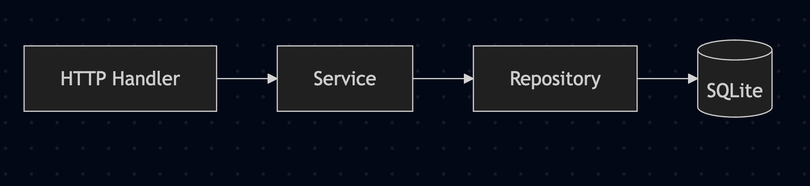
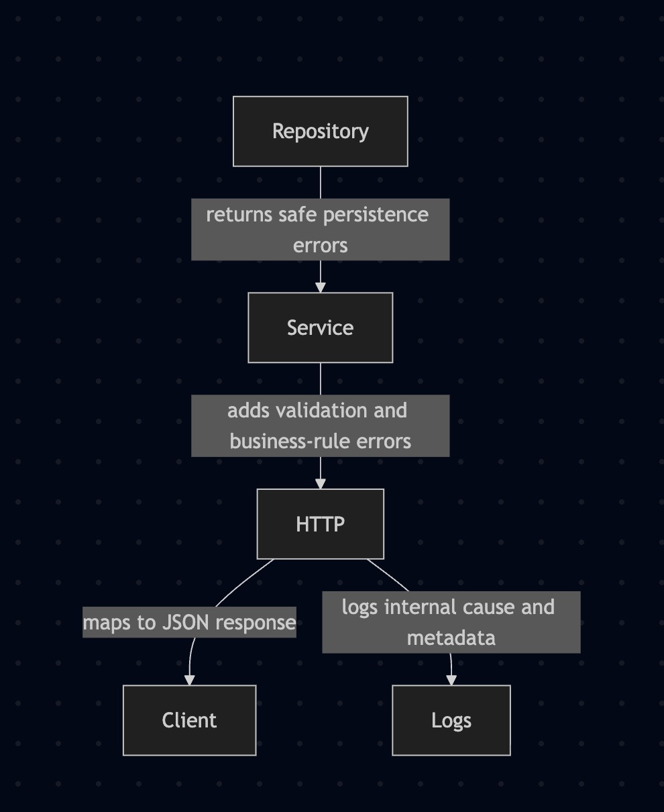
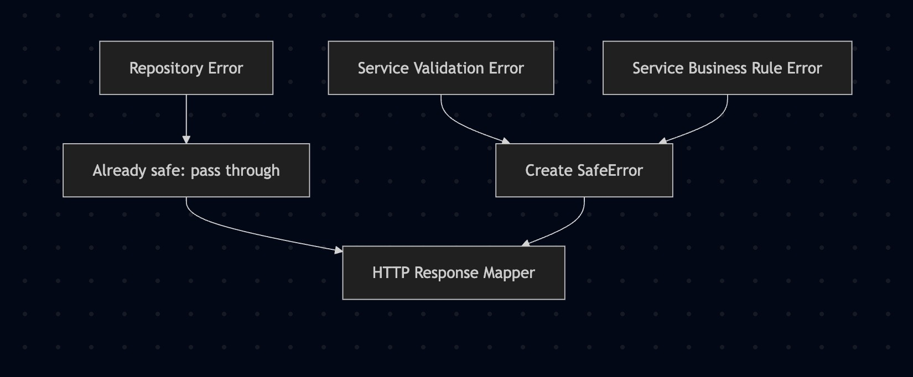
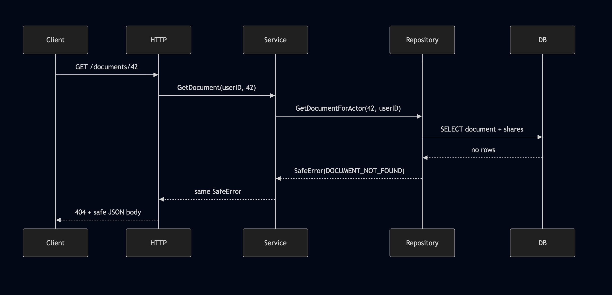

In the March 2026 edition of Golang Weekly, I found a post from the GoLand team at JetBrains about secure errors in Go:

- Golang Weekly issue: https://golangweekly.com/issues/592
- JetBrains post: https://blog.jetbrains.com/go/2026/03/02/secure-go-error-handling-best-practices/

The idea is simple and useful: different errors need different handling.

Some errors are safe to show to a client. Some should be logged with extra context for operators. Some should stay internal because they might leak database details, file paths, SQL statements, or implementation choices that clients should never see.

That is also one of the reasons I like Go. The language forces you to think about error handling. You do not get to ignore it for long. In a large codebase, though, `if err != nil` can become repetitive enough that teams stop asking the important question:

`What kind of error is this, and who should be allowed to see it?`

This post shows a small practical implementation of that idea. I built a document vault app with three layers:

- HTTP
- service
- repository

The goal here is to show a structure that makes secure error handling easy to reason about.

## The Example App

The demo app is a small document vault. A user can:

- create a document
- list their own documents
- fetch a document
- update a document
- delete a document
- share a document with another user

That gives us enough room to demonstrate the most common error cases:

- invalid input
- unauthenticated requests
- forbidden access
- document not found
- duplicate document title
- duplicate share
- internal database failure

This is the runtime flow:



And this is the error ownership model:



That separation is the whole point.

- The repository knows about persistence problems.
- The service knows about business rules.
- The HTTP layer knows how to turn a safe error into a response.

## The Core Type: SafeError

The project uses a `SafeError` type as the common contract across the stack.

It contains:

- a machine-readable error code
- a user-safe message
- an HTTP status
- the internal wrapped error
- sanitized metadata for logs

The key rule is this:

The client gets the code, message, and request ID. The logs get the wrapped internal cause.

That lets you keep responses clean without throwing away useful debugging information.

In practice, the response shape looks like this:

```json
{
  "error": {
    "code": "DOCUMENT_NOT_FOUND",
    "message": "Document not found.",
    "request_id": "req-1773150000000000000-1"
  }
}
```

The client gets a clear error. The logs still show what actually went wrong.

## Layer 1: Repository

The repository talks to SQLite and returns safe persistence errors.

That part matters. Raw SQL driver messages should not escape into the service or HTTP response by accident. Callers also should not need to understand SQLite constraint errors.

So the repository translates low-level failures into explicit safe errors such as:

- `DOCUMENT_NOT_FOUND`
- `DOCUMENT_CONFLICT`
- `SHARE_CONFLICT`
- `DATABASE_ERROR`

This is an important design choice.

I started with a generic conflict like `DATABASE_CONFLICT`, but that was too vague once the service stopped remapping repository errors. The better option was to make the repository more explicit about *what* conflicted.

That means:

- duplicate document title becomes `DOCUMENT_CONFLICT`
- duplicate share becomes `SHARE_CONFLICT`

The service can now pass those through without losing clarity.

Here is the repository responsibility in one sentence:

`Translate storage failures into safe persistence errors.`

## Layer 2: Service

The service layer does not know anything about SQL, tables, or drivers. It works in terms of application rules.

This is where I handle things like:

- missing `X-User-ID`
- invalid title
- oversized content
- sharing a document with yourself
- forbidden access to someone else’s document

That means the service is responsible for validation and business rules.

This was one of the cleaner outcomes of the refactor. The repository now owns persistence-safe errors, and the service owns application-safe errors.

Visually, it looks like this:



Examples:

- If the database says the document does not exist, the repository returns `DOCUMENT_NOT_FOUND`.
- If the request has no user header, the service returns `UNAUTHENTICATED`.
- If the user tries to read another person’s private document, the service returns `FORBIDDEN`.

That split keeps each layer honest.

## Layer 3: HTTP

The HTTP layer has one job: map safe errors to HTTP responses consistently.

It does not need to know how SQLite reports unique constraints. It does not need to know the rules for sharing documents. It does not need to decide which internal fields are safe.

It just does this:

1. call the service
2. inspect the returned `SafeError`
3. write a JSON response with status, code, message, and request ID
4. log the internal cause and metadata

This keeps handlers small and predictable.



When this pattern is in place, the HTTP layer becomes boring in the best possible way.

## Why This Structure Works

There are two failure modes I try to avoid in Go apps:

### 1. Everything becomes an internal error

If every failure turns into `"internal server error"`, the client has a bad experience and your API becomes hard to use. A duplicate title differs from a missing document. A bad JSON payload differs from a database outage.

### 2. Too much detail leaks to the client

This is the more dangerous one.

You should avoid returning:

- SQL statements
- raw driver errors
- table names
- file paths
- implementation-specific details

That information is useful for operators and developers. Clients do not need it in the reponse.

The layered approach gives each piece a clean role:

- repository decides safe persistence errors
- service decides safe business and validation errors
- http decides response formatting and logging

## A Few Concrete Examples

Here are a few examples from the document vault:

| Scenario | Layer that decides | Public code |
| --- | --- | --- |
| Missing user header | service | `UNAUTHENTICATED` |
| Empty title | service | `INVALID_REQUEST` |
| Reading someone else's document | service | `FORBIDDEN` |
| Document row missing | repository | `DOCUMENT_NOT_FOUND` |
| Duplicate title for same owner | repository | `DOCUMENT_CONFLICT` |
| Duplicate share | repository | `SHARE_CONFLICT` |
| Unexpected database failure | repository | `DATABASE_ERROR` |

That table is a good design check. If you cannot tell which layer should own an error, the architecture is probably still fuzzy.

## One Small but Important Lesson

One detail changed while building this example.

At first, the service translated repository errors into service-specific errors. That is a common approach, and it can work well.

Then the repository was refactored to return safe errors directly. At that point, the service was wrapping errors that were already safe, which made the code noisier and less consisent.

The fix was to commit to a contract:

`Repository errors are already safe.`

Once that was true, the code got simpler.

The only follow-up change was to make repository conflicts explicit enough to stand on their own. That is why `DOCUMENT_CONFLICT` and `SHARE_CONFLICT` now come from the repository instead of a generic database conflict.

## Final Thoughts

Secure error handling is about being precise about what belongs where.

Clients need stable, useful, safe error messages.
Operators need internal causes and structured context.
Developers need a clear place to make those decisions.

A small layered app makes that easier:

- repository for persistence-safe errors
- service for validation and business rules
- HTTP for response mapping and logging

I built this project to make that pattern easier to see in actual code.

If you want the finished code for refernce, it is here:

- https://github.com/hyeomans/document-vault-safe-errors

The JetBrains post is worth reading too. After that, build a small version yourself. This stuff makes a lot more sense once you watch the errors move through a real request.
