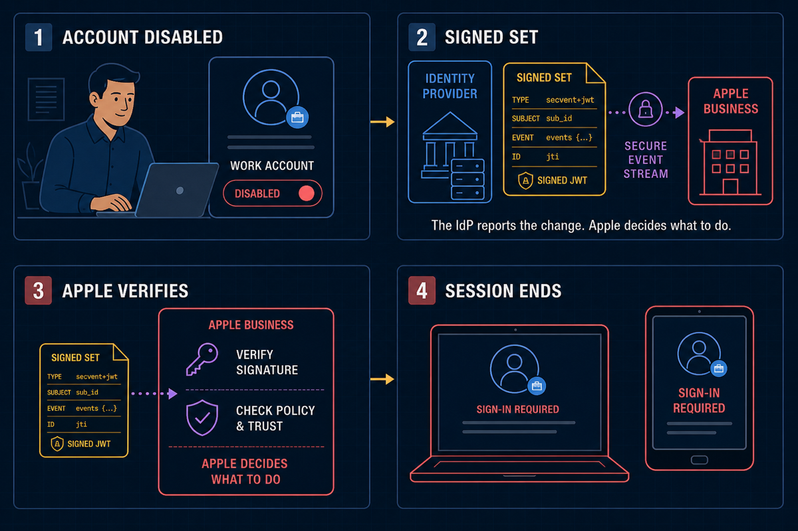
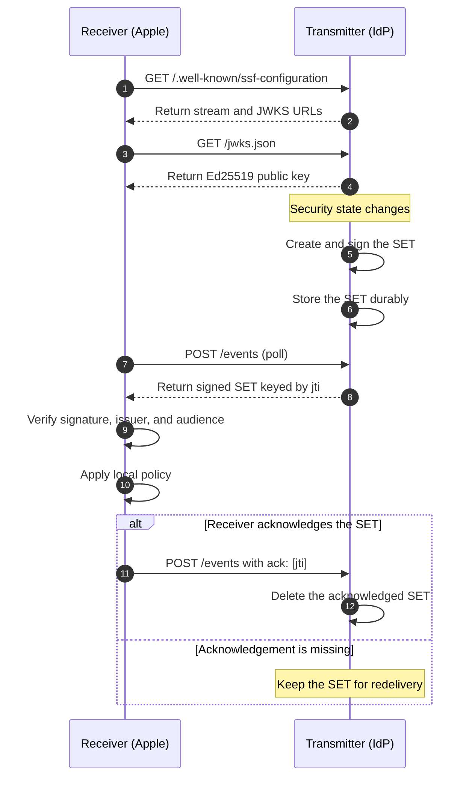

import { Code } from 'astro:components';
import SsfPollTransmitterDiagram from '../../../../components/architecture/SsfPollTransmitterDiagram.astro';
import goMod from './demo/go.mod?raw';
import mainGo from './demo/main.go?raw';
import mainTest from './demo/main_test.go?raw';

An access token is a snapshot. It says what was true when the issuer created it. But security state can change one second later. A user can sign out. An administrator can disable an account. A device can fall out of compliance.

How does another system learn about that change without waiting for the token to expire?

The [Shared Signals Framework (SSF) 1.0](https://openid.net/specs/openid-sharedsignals-framework-1_0-final.html) gives cooperating systems a standard way to exchange security events. This post explains the small set of ideas behind SSF and builds a runnable transmitter in Go. The transmitter signs a session-revoked event, stores it in SQLite, and keeps offering it to a receiver until the receiver acknowledges it.

## What is SSF?

SSF is an OpenID standard for sending security signals between trusted parties. It defines how two roles work together:

- A **transmitter** creates and sends events.
- A **receiver** gets those events, verifies them, and decides what to do.

The two parties communicate through an **event stream**. A stream records which event types the receiver can expect and whether delivery uses HTTP push or HTTP polling.

Each security event travels as a **Security Event Token (SET)**. A SET is simply a signed JWT for a security event. Its `events` claim says what happened. The [SET specification](https://www.rfc-editor.org/rfc/rfc8417.html) defines the token; SSF defines how it moves from the transmitter to the receiver.

SSF is the pipe, not the complete meaning of every event. Profiles define useful event families on top of it:

- [CAEP](https://openid.net/specs/openid-caep-1_0-final.html) covers changes such as a revoked session, changed token claims, or changed device compliance.
- [RISC](https://openid.net/specs/openid-risc-1_0-final.html) covers account-risk events such as an account being disabled or compromised.

A signal is a fact, not a remote command. The receiver still owns the policy decision. A `session-revoked` event may cause one receiver to end a session immediately and another to ask for stronger authentication.

## A practical example

Imagine a company that connects [Apple Business](https://support.apple.com/guide/business/federated-authentication-identity-provider-axmfcab66783/web) to its identity provider. Employees use their work credentials to sign in to Managed Apple Accounts. During setup, Apple Business asks for the identity provider's SSF configuration URL. Apple uses that URL to find the SSF endpoints and signing keys.

Apple is the receiver in this connection. The identity provider is the transmitter.

Now suppose an employee leaves the company. An administrator disables the employee's work account. The identity provider creates a signed SET that describes the change and sends it through the event stream. Apple verifies the SET before using it. It checks that the identity provider signed it and that the event was meant for Apple.



If the SET is valid, Apple can end the employee's Managed Apple Account session or ask the employee to sign in again. Apple decides which action to take. The identity provider only reports what changed.

Apple can react as soon as the identity provider knows about the change. It does not have to wait for an old access token to expire.

## Why SSF matters

Without shared signals, a receiver often has two weak choices. It can trust an access token until it expires, even when the issuer already knows the session is unsafe. Or it can keep asking the issuer whether anything changed, which adds delay and load.

SSF adds a third option: send a small, signed event when the state changes.

That helps in four practical ways:

1. **Faster response.** A receiver can react to a revoked session without waiting for token expiry.
2. **Clear trust.** Signed SETs let the receiver verify who issued an event and who should receive it.
3. **Shared language.** CAEP and RISC give different products the same event names and shapes.
4. **Reliable delivery.** Poll and push protocols define acknowledgements, errors, and redelivery behavior.

SSF does not replace OAuth or OpenID Connect. OAuth still protects API access. OpenID Connect still handles sign-in and identity claims. SSF carries later changes that may affect an existing session or access decision.

## What we will build

The demo is a small **poll-based SSF transmitter**. It implements the parts needed to prove one complete delivery:

- `main.go` is the company's **identity provider** and SSF **transmitter**.
- `main_test.go` plays **Apple** as the SSF **receiver**.

The code uses `https://apple.example/ssf` as Apple's audience. The `.example` address is deliberately fictional; it is not an Apple production endpoint.

- transmitter discovery at `/.well-known/ssf-configuration`;
- a public Ed25519 key at `/jwks.json`;
- one preconfigured event stream at `/ssf/stream`;
- a local-only `/emit` endpoint that creates a CAEP `session-revoked` event;
- [RFC 8936](https://www.rfc-editor.org/rfc/rfc8936.html) poll delivery at `/events`;
- a SQLite table that holds unacknowledged SETs and schedules redelivery; and
- an end-to-end test in which the Apple receiver discovers the IdP, verifies its SET, and acknowledges delivery.

The `/emit` endpoint is a demo input, not an SSF endpoint. In a real identity system, an account service or risk engine would call the transmitter through an internal interface.

<SsfPollTransmitterDiagram />

The important boundary is the SQLite commit. The transmitter reports that an event was queued only after the signed SET is durable. Polling does not delete it. Only an acknowledgement containing the event's `jti` removes the row.

## The SET we will send

The signed payload looks like this before JWT encoding:

```json
{
  "iss": "http://localhost:8080",
  "aud": "https://apple.example/ssf",
  "iat": 1787337600,
  "jti": "e77cf6b5-4876-4450-b380-bd8b92cc7287",
  "txn": "af59b929-e94a-4d4c-b009-5f91b99981c0",
  "sub_id": {
    "format": "opaque",
    "id": "session-123"
  },
  "events": {
    "https://schemas.openid.net/secevent/caep/event-type/session-revoked": {
      "event_timestamp": 1787337600
    }
  }
}
```

A few details are easy to miss:

- The JOSE header uses `typ: "secevent+jwt"`. This stops code from confusing a SET with an ID token or access token.
- The top-level `sub_id` identifies the subject of the event. An SSF SET must not use the normal JWT `sub` claim for this purpose.
- SSF SETs must not contain `exp`. Delivery and retention rules decide when an event is still useful.
- The `iss` value must match the stream and the trusted discovery issuer.
- The receiver must check that `aud` identifies it.
- `jti` identifies this SET. Poll delivery uses that value for acknowledgement and deduplication.
- `txn` connects SETs that came from the same underlying incident.

The code signs this payload with Ed25519 and publishes the public key as a JSON Web Key Set. A production receiver should verify the signature, `typ`, `iss`, `aud`, event type, and subject before it changes local access.

## How the receiver and transmitter interact

The receiver starts with the transmitter's SSF configuration URL. It uses that document to find the event stream and the transmitter's public signing key. When a security change happens, the transmitter creates and stores a signed SET.

The receiver polls for events, verifies each SET, and decides what to do. It then acknowledges the SET by its `jti`. Until that acknowledgement arrives, the transmitter keeps the SET so it can deliver it again.

<div className="ssf-interaction-diagram wide-media">



</div>

## Create the Go project

The example needs Go 1.24 or newer. It uses the pure-Go `modernc.org/sqlite` driver, so it does not need a C compiler.

```bash
mkdir ssf-transmitter
cd ssf-transmitter
```

Create `go.mod`:

<Code code={goMod} lang="go" themes={{ light: 'github-light', dark: 'github-dark' }} defaultColor={false} />

Then create `main.go`. This is the complete transmitter used by the tests in this post:

<Code code={mainGo} lang="go" themes={{ light: 'github-light', dark: 'github-dark' }} defaultColor={false} />

The queue has a small state model:

- A new row starts as `queued` and can be delivered now.
- A poll atomically moves `deliver_after` into the future and returns the SET.
- If no acknowledgement arrives, the same row becomes available again after 30 seconds.
- An `ack` deletes the row.
- A `setErrs` entry marks the row as `failed` so the demo keeps it for inspection instead of sending the same invalid token forever.

SQLite is not part of SSF. It is only the transmitter's internal durable queue. PostgreSQL, a cloud queue, or another durable store can serve the same role as long as claiming and acknowledging events stay safe under concurrency.

## Run the transmitter

First download the dependency and start the server:

```bash
go mod tidy
export SSF_BEARER_TOKEN=dev-token
go run .
```

The first run creates two local files:

- `ssf.db` holds the delivery queue.
- `ssf-ed25519.key` holds the private signing key with file mode `0600`.

The discovery document is public:

```bash
curl -s http://localhost:8080/.well-known/ssf-configuration | jq
```

It points the receiver to the JWKS and stream configuration endpoints.

## Queue and poll one event

In another terminal, create a session-revoked event:

```bash
curl -s \
  -H 'Authorization: Bearer dev-token' \
  -H 'Content-Type: application/json' \
  -d '{"subject_id":"session-123"}' \
  http://localhost:8080/emit | jq
```

The response contains the new `jti`:

```json
{
  "jti": "e77cf6b5-4876-4450-b380-bd8b92cc7287",
  "queued": true
}
```

Now poll the stream and save the response:

```bash
POLL_RESPONSE=$(curl -s \
  -H 'Authorization: Bearer dev-token' \
  -H 'Content-Type: application/json' \
  -d '{"maxEvents":10,"returnImmediately":true}' \
  http://localhost:8080/events)

echo "$POLL_RESPONSE" | jq
```

RFC 8936 returns a `sets` object. Each key is a `jti`; each value is the compact signed SET:

```json
{
  "sets": {
    "e77cf6b5-4876-4450-b380-bd8b92cc7287": "eyJhbGciOiJFZERTQSIsImtpZCI6ImRlbW8ta2V5LTEiLCJ0eXAiOiJzZWNldmVudCtqd3QifQ..."
  }
}
```

Poll again before acknowledging and the response is empty until the 30-second retry window passes. After that window, the same `jti` and SET are delivered again. This is at-least-once delivery, so a receiver must deduplicate events by `jti`.

Once the receiver has verified and retained the SET, acknowledge it:

```bash
JTI=$(echo "$POLL_RESPONSE" | jq -r '.sets | keys[0]')

curl -s \
  -H 'Authorization: Bearer dev-token' \
  -H 'Content-Type: application/json' \
  -d "{\"ack\":[\"$JTI\"],\"maxEvents\":0,\"returnImmediately\":true}" \
  http://localhost:8080/events | jq
```

`maxEvents: 0` makes this an acknowledge-only request. The transmitter deletes the matching SQLite row and returns an empty set:

```json
{
  "sets": {}
}
```

You can inspect the queue directly if the `sqlite3` CLI is installed:

```bash
sqlite3 ssf.db \
  'SELECT jti, status, attempts, last_error FROM ssf_events;'
```

Before the acknowledgement, the query shows one row. After it, the query returns no rows.

## Prove the complete flow with a test

Create `main_test.go` beside `main.go`:

<Code code={mainTest} lang="go" themes={{ light: 'github-light', dark: 'github-dark' }} defaultColor={false} />

Run it:

```bash
go test ./...
```

The test proves more than a handler returning `200`. It checks the boundary between both roles:

1. Apple discovers the IdP's stream endpoint and downloads its public signing key;
2. the IdP commits a SET to SQLite before delivery;
3. the IdP redelivers the same token when Apple has not acknowledged it;
4. Apple verifies the signature, key ID, `typ`, `iss`, `aud`, event type, and subject; and
5. the IdP removes the row after Apple acknowledges its `jti`.

## What to change before production

This demo is intentionally small. It is useful for learning and local integration tests, but it is not a production SSF service.

Before using the design in production:

- Serve every endpoint over HTTPS. The `http://localhost` issuer exists only for this local demo.
- Replace the shared development bearer token with a strong authorization scheme. Depending on the partnership, that may be OAuth client credentials, private-key JWT authentication, or mutual TLS.
- Store signing keys in a key-management system, publish overlapping keys during rotation, and handle JWKS caching safely.
- Implement the full stream management, status, subject, and verification APIs that your interoperability profile requires.
- Validate requested event types and ensure one receiver cannot read another receiver's stream.
- Encrypt SETs with JWE when TLS does not provide enough confidentiality for the event data.
- Add rate limits, request size limits, audit logs, metrics, retention rules, and dead-letter handling.
- Test duplicate delivery, concurrent pollers, database failures, key rotation, unknown event types, and malformed acknowledgements.

Most importantly, agree on receiver behavior. SSF tells you how to exchange a trusted signal. The two parties still need a clear contract for what that signal means and how quickly the receiver should act.

## The main idea

SSF closes the gap between "this token was valid when I issued it" and "the security state has changed now."

A basic transmitter needs only a few solid pieces: create a correctly shaped SET, sign it, store it before reporting success, deliver it through a standard method, and keep it until the receiver acknowledges the exact `jti`.

The Go service in this post does that with one process and one SQLite file. The code is small enough to inspect, but the delivery behavior is real: no acknowledgement means redelivery; acknowledgement means the message leaves the queue.

## Further reading

- [OpenID Shared Signals Framework 1.0](https://openid.net/specs/openid-sharedsignals-framework-1_0-final.html)
- [OpenID Continuous Access Evaluation Profile 1.0](https://openid.net/specs/openid-caep-1_0-final.html)
- [OpenID RISC Profile 1.0](https://openid.net/specs/openid-risc-1_0-final.html)
- [RFC 8417: Security Event Token](https://www.rfc-editor.org/rfc/rfc8417.html)
- [RFC 8936: Poll-Based SET Delivery Using HTTP](https://www.rfc-editor.org/rfc/rfc8936.html)
- [RFC 9493: Subject Identifiers for Security Event Tokens](https://www.rfc-editor.org/rfc/rfc9493.html)
