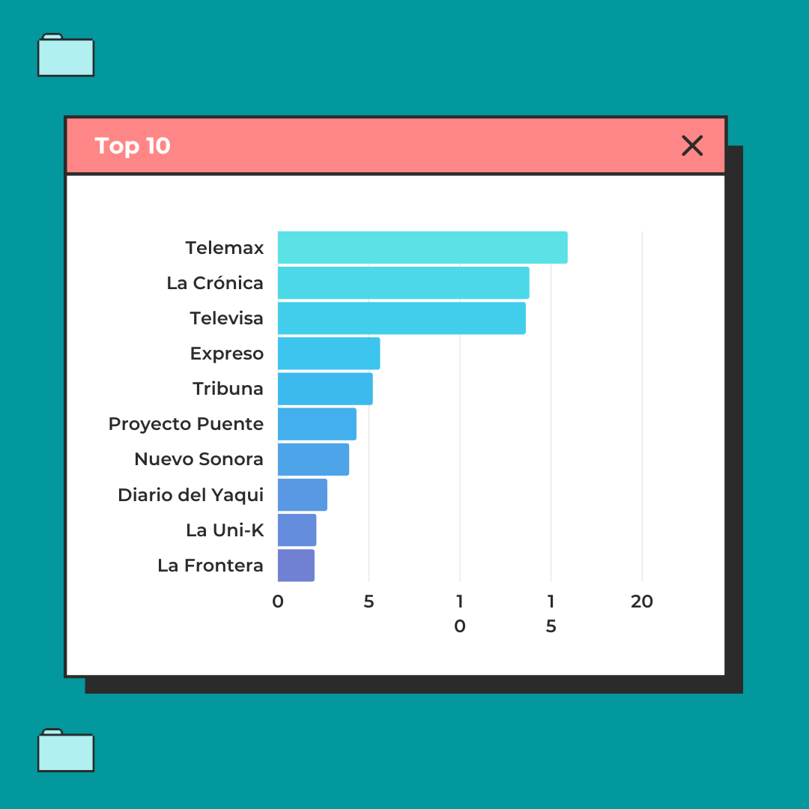
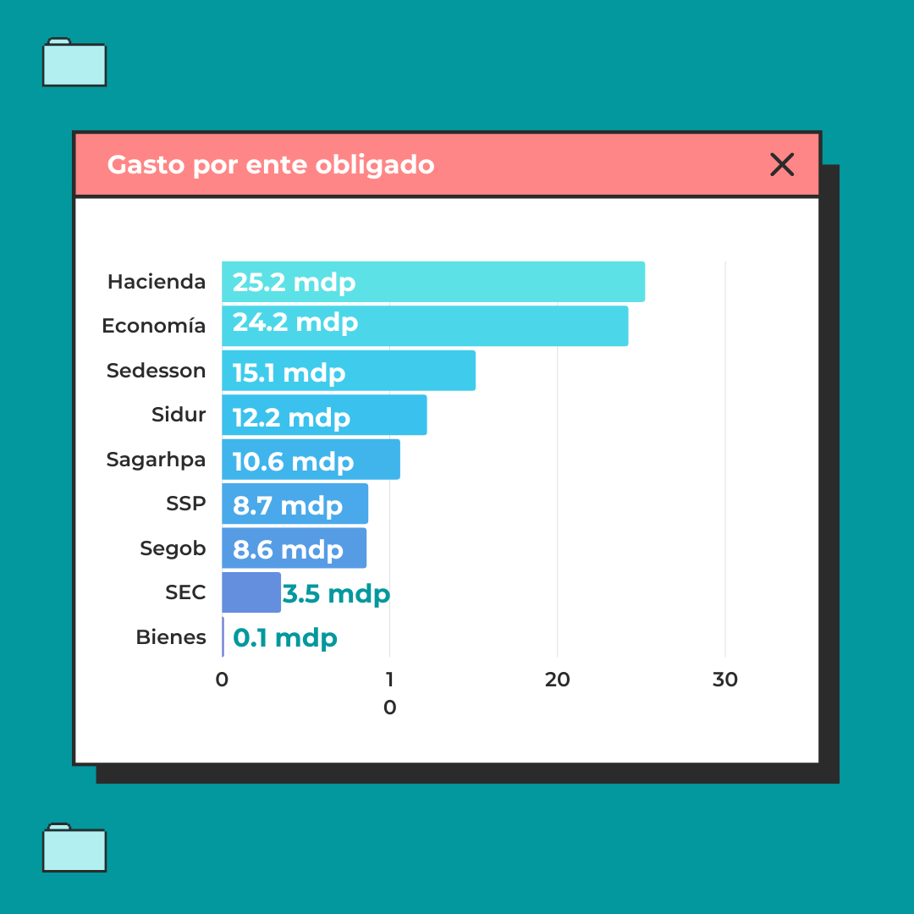

Este post va a ser un cambio de ritmo. Como ya dije en mi Twitter, me voy a tomar un break de todo este lío de transparencia y política. Entrar en el mundo de la transparencia me ha permitido conocer a un montón de gente interesante con la que jamás pensé cruzarme. Un proyecto de software me ha dado la excusa perfecta para alejarme un poco del circo político. Pero antes de cerrar este capítulo, tengo una "espinita" que necesito sacar. Es sobre una de las últimas peticiones de transparencia que hice y ya se la he pasado a varios colegas periodistas y diputados. Aquí intentaré explicar cómo llegué a la idea y por qué debería importarte.

Hice una solicitud para que varias dependencias me detallaran los gastos en partidas presupuestales relacionadas con medios de comunicación. Hablo de las partidas 36101, 36301 y 36601, y aquí te doy un resumen de qué trata cada una:

- 36601: Para servicios de creación y difusión de contenido exclusivamente en internet.
- 36301: Para creatividad, preproducción y producción de publicidad, excepto internet.
- 36106: Para difusión por radio, televisión y otros medios de mensajes sobre programas y actividades gubernamentales.

Centré mi investigación en el Gobierno del Estado de Sonora desde enero de 2022 hasta marzo de 2023. ¿Por qué empezar en enero? Porque es cuando la nueva administración de la 4T en Sonora empezó a jugar con el presupuesto que ellos mismos habían aprobado. Y ¿hasta junio del 2023? Pues porque cada dependencia tiene que preparar un informe semestral para el "Analítico de Partidas" del Ejecutivo, que puedes encontrar en la página de Hacienda de Sonora.

Ahora, hablemos del Sistema Estatal de Comunicación Social, que está bajo el paraguas del "Ejecutivo del Estado". Según su propio organigrama en su portal de transparencia, uno pensaría que todo el dinero para comunicación sale de ahí, ¿verdad? Pero aquí viene lo curioso: según el analítico de partidas, en 2022 este sistema gastó un total de $18,898,817. Sinceramente, eso no es suficiente para mantener a todos los periodistas\* que tenemos en Sonora.

---

> Otro dato curioso: hasta junio de 2023, no tenemos un Secretario Técnico de la Mesa de Seguridad. ¿Qué pasó ahí? ¿Alguien lo va a reemplazar o ya lo han reemplazado y no me enteré?

---

Según lo que entendí, el Sistema Estatal de Comunicación Social es quien hace los acuerdos con los periodistas*. En resumen, parece que la oficina del Sistema Estatal le dice a cada medio de comunicación: "Oye, factura esto a tal dependencia". Entonces pensé, si sumo todas esas partidas presupuestales, debería obtener el total de lo que gastamos en comunicación social. También pedí el listado de los nombres comerciales de los periodistas* que están en el listado de lo que se erogó.

Así quedó la solicitud:

> Estimados responsables,
> Por medio de la presente, de acuerdo al analítico de partidas del Ejecutivo, me dirijo a ustedes para solicitar información sobre el presupuesto erogado por este ente obligado a partir de las partidas 36101, 36301 y/o 36601.
> Mi solicitud específica es la siguiente: Por favor, proporcionen un listado de lo erogado durante el periodo comprendido desde enero de 2022 hasta el final del segundo trimestre de 2023. Este listado debe estar dividido por nombre comercial, razón social y monto de cada una de las diferentes razones sociales a las que se les haya asignado presupuesto.
> Además, solicito que la información se entregue en un formato de datos abiertos, preferentemente Excel o CSV, pero un PDF editable también sería aceptable, con el fin de permitir su máxima publicación y acceso para el público en general.
> Agradezco de antemano su atención y colaboración en este asunto.

La envié a estos entes obligados:

1. Secretaría de Agricultura, Ganadería, Recursos Hidráulicos, Pesca y Acuacultura
1. Secretaría de Economía
1. Secretaría de Infraestructura y Desarrollo Urbano
1. Gubernatura
1. Secretaría de Desarrollo Social del Estado de Sonora
1. Secretaría de Hacienda
1. Secretaría de Gobierno
1. Secretaría de Seguridad Pública
1. Oficialía Mayor del Estado de Sonora
1. Comisión Estatal de Bienes y Concesiones
1. Secretaría de Educación y Cultura

El total, ya sumando las 3 partidas de cada dependencia de Enero 2022 a Junio 2023 es un total de **$108,660,363.07** (Ciento ocho millones, seiscientos sesenta mil trescientos sesenta y tres pesos).

Debo recalcar que la Secretaría de Educación y la Gubernatura no contestaron lo que se le pidió. La respuesta la sometí a queja, y el Instituto de Transparencia de Sonora **falló** a mi favor. El ISTAI notificó a los entes obligados que tienen siete días hábiles para responder la solicitud de acceso a la información. A ambos entes obligados se les notificó el 29 de agosto del presente año.

## Análisis

Para mí lo más interesante de recibir datos duros siempre es, quien recibió más y quién recibió menos, cuanto se gasta por ente obligado, quien gastó más por ente obligado.

Lo más complicado de todo esto es limpiar y estructurar los datos. Por ejemplo, pedí nombres comerciales y razones sociales, pero las respuestas fueron inconsistentes. Tuve que hacer un trabajo de limpieza para asegurarme de que todo estuviera en su sitio, como que Proyecto Puente es el nombre comercial pero su razón social es Sistema Estatal de Información Web. Vamos, que tener datos es una cosa, pero analizarlos es otra completamente diferente.

### ¿Quién recibió más dinero?

Después de analizar el gasto durante 18 meses, está claro que Telemax encabeza la lista en recibir presupuesto. Le siguen tanto medios de renombre como otros poco conocidos. No es una cuestión menor.

Para respaldar lo anterior, aquí están los datos fríos:

| Razón Social                                        | Total          |
| --------------------------------------------------- | -------------- |
| Televisora De Hermosillo Sa De Cv                   | $15,927,996.97 |
| Impresora Y Editorial Sa De Cv                      | $13,829,878.44 |
| Televisa S De Rl De Cv                              | $13,674,901.28 |
| Medios Y Editorial De Sonorasa De Cv                | $5,696,223.05  |
| Tribuna Del Yaqui Sa De Cv                          | $5,245,926.00  |
| Sistema Estatal De Informacion Websa De Cv          | $4,399,880.00  |
| Feliciano Guirado Moreno                            | $3,915,331.50  |
| Editorial Diario Del Yaqui, Sa De Cv                | $2,794,886.08  |
| Radio Grupo Garcia De Leon Sa De Cv                 | $2,189,616.00  |
| Editorial Diario De La Frontera, Sa De Cv           | $2,039,466.44  |
| Promotora Radiovision Sa De Cv                      | $1,827,232.00  |
| Grupo Editorial Medios Obson Eltiempo S De Rl De Cv | $1,750,000.00  |
| Televisora Del Yaqui, Sa De Cv                      | $1,682,667.00  |

Me llama la atención que hubo transferencias a Telemax, además de su presupuesto asignado. Por ejemplo, para 2022 su presupuesto original era de 108 millones, pero luego sufrió modificaciones para erogar un total de 64 millones.

### ¿Cómo se distribuyó el gasto?

Aunque es el Sistema Estatal de Comunicación Social quién dirije los pagos, cada ente obligado tuvo egresos en las partidas antes mencionadas. Así se distribuyó el gasto:

He aquí los datos que alimentan la gráfica anterior:

| Dependencia                              | Suma            |
| ---------------------------------------- | --------------- |
| Comisión Estatal de Bienes y Concesiones | $167,000.00     |
| Secretaría de Educación y Cultura        | $3,579,907.76   |
| SEGOB                                    | $8,607,916.80   |
| SECRETARÍA DE SEGURIDAD                  | $8,794,733.67   |
| SAGARHPA                                 | $10,668,938.41  |
| SIDUR                                    | $12,224,215.22  |
| SEDESSON                                 | $15,164,868.18  |
| SECRETARÍA DE ECONOMÍA                   | $24,229,195.69  |
| SECRETARÍA DE HACIENDA                   | $25,223,587.34  |
| **Suma total**                           | $108,660,363.07 |

### ¿Quienes han recibido menos?

En el otro extremo, tenemos entidades y personas que recibieron montos insignificantes en comparación.

| Razón Social                       | Total      |
| ---------------------------------- | ---------- |
| Alfredo Fabian Garcia              | $11,600.00 |
| Santiago Gomez Palomares           | $11,600.00 |
| Patricia Rodriguez Camacho         | $13,920.00 |
| Gilberto Soto Hernandez            | $14,999.99 |
| Rafael Ernesto Hernandezvalenzuela | $20,000.00 |
| Belem Guadalupe Fuentes Santacruz  | $23,200.00 |
| Diario Digital Agua Pretense       | $23,200.00 |
| El Solazo De Hermosillo            | $23,200.00 |
| Francisco Javier Santin Vazquez    | $23,200.00 |
| Frente La Noticia                  | $23,200.00 |
| Gerardo Jose Ponce De Leon Moreno  | $23,200.00 |

### ¿Dónde podemos ver todo el listado?

Si quieren verificar cada número y cada entidad, los listados completos están disponibles en los siguientes enlaces:

- Listado Completo: https://bit.ly/44M60Ra
- Respuestas de los Entes Obligados y Fallo del ISTAI: https://bit.ly/3Pdsvc1

## Conclusión

Estamos hablando de 108 millones de pesos repartidos entre 108 medios. La pregunta clave es: ¿es esto un buen uso de los fondos públicos? Mi veredicto es un rotundo no. Claro, si le preguntas a los medios beneficiados o a funcionarios gubernamentales, algunos te dirán que es vital. Pero eso es esperado; cada quien cuida su trozo de pastel.

Ahora, la falta de respuesta a mi solicitud de transparencia por parte de la SEC y la Gubernatura, es un insulto a la transparencia. Tienen sus plazos, que ya incumplieron. Y sí, aunque puede parecer un detalle menor en el vasto universo burocrático, la falta de respuesta es reveladora. Si no pueden manejar las pequeñeces, ¿cómo confiar en ellos para las cosas que realmente importan?

Y no nos olvidemos del elefante en la sala: el mes pasado, mientras la administración actual se dedicaba a juegos políticos y precampañas, el trabajo real quedó en el limbo. Descuidaron el puesto, sencillo y claro.

Para rematar, en ese listado de beneficiados, tenemos empresas fantasma y personajes con vínculos estrechos con el gobierno. ¿Conflicto de interés, tal vez? Lo dejo como tarea para los 108 medios de comunicación que recibieron su tajada del pastel. Si no lo investigan, están fallando como cuarto poder.

Así que ahí lo tienen. Mi dosis de transparencia por el momento está completa. Hasta pronto.
