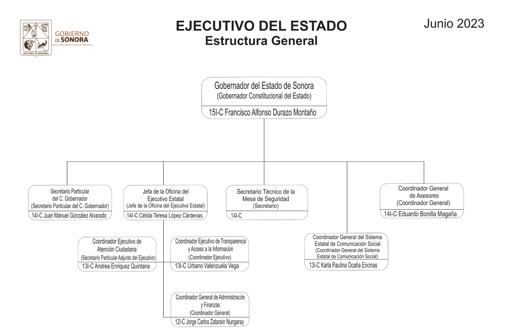
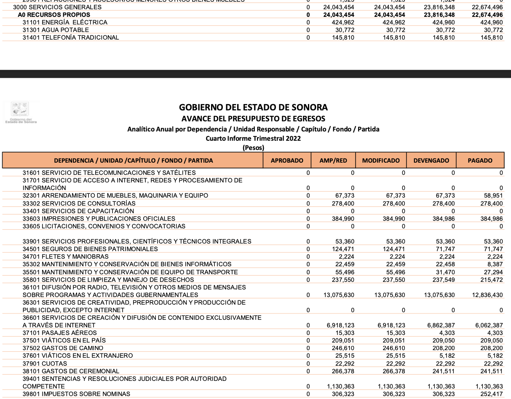
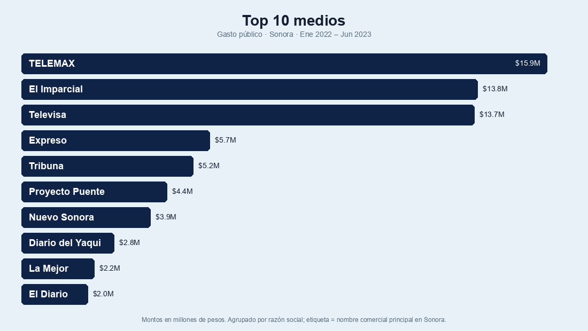
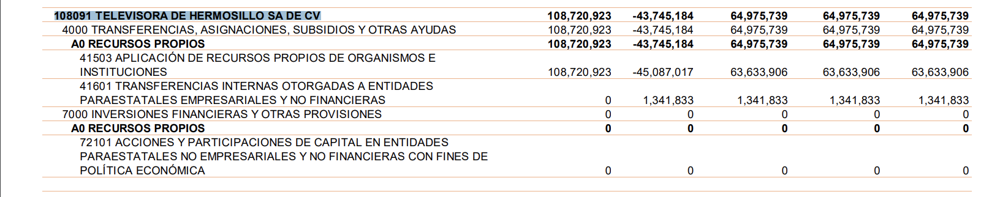
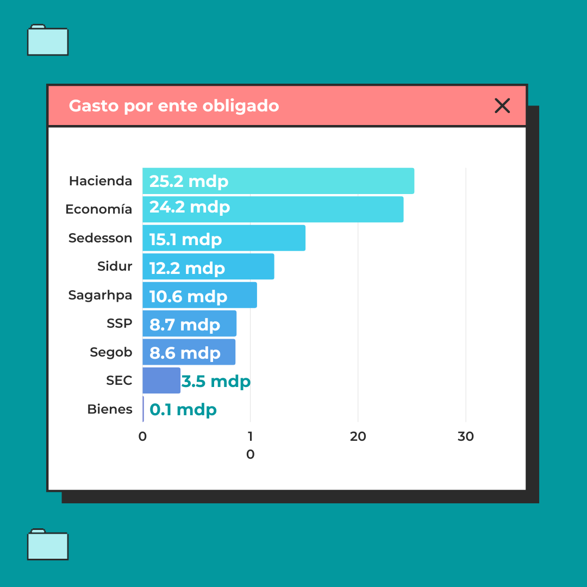

Pedí a varias dependencias del Gobierno de Sonora el desglose de lo erogado en partidas de comunicación social entre enero de 2022 y junio de 2023. El total: **$108,660,363.07**, repartidos entre 108 medios.

Las partidas que pedí fueron:

- **36101**: difusión por radio, televisión y otros medios de mensajes sobre programas y actividades gubernamentales.
- **36301**: creatividad, preproducción y producción de publicidad (excepto internet).
- **36601**: creación y difusión de contenido exclusivamente en internet.

Elegí ese periodo porque arranca con el presupuesto de la administración actual y cierra en el segundo semestre reportado en el Analítico de Partidas del Ejecutivo.

## Por qué no bastaba con Comunicación Social

El Sistema Estatal de Comunicación Social aparece en el organigrama del Ejecutivo como el brazo de difusión del gobierno. En el analítico de 2022, esa oficina reportó **$18,898,817**. Con esa cifra no se sostiene el ecosistema de medios que hay en Sonora.

La lectura que hago es esta: Comunicación Social negocia con los medios, y luego les indica a qué dependencia facturar. Si eso es cierto, el gasto real no está en una sola oficina: está repartido en las partidas de varias secretarías. Por eso pedí el listado completo, con nombre comercial, razón social y monto.

La solicitud fue, en resumen:

> Listado de lo erogado de enero 2022 al segundo trimestre de 2023 en las partidas 36101, 36301 y/o 36601, dividido por nombre comercial, razón social y monto, en formato abierto (Excel, CSV o PDF editable).

La mandé a:

1. Secretaría de Agricultura, Ganadería, Recursos Hidráulicos, Pesca y Acuacultura (SAGARHPA)
1. Secretaría de Economía
1. Secretaría de Infraestructura y Desarrollo Urbano (SIDUR)
1. Gubernatura
1. Secretaría de Desarrollo Social (SEDESSON)
1. Secretaría de Hacienda
1. Secretaría de Gobierno (SEGOB)
1. Secretaría de Seguridad Pública
1. Oficialía Mayor
1. Comisión Estatal de Bienes y Concesiones
1. Secretaría de Educación y Cultura

**Educación y la Gubernatura no entregaron el listado pedido.** Presenté queja ante el ISTAI; falló a mi favor y les dio siete días hábiles a partir del 29 de agosto de 2023.

## Quién recibió más

Limpiar los datos fue la parte más larga. Pedí nombre comercial y razón social; las respuestas llegaron incompletas, mezcladas o con “No contestó”. Ejemplo: **Proyecto Puente** es el nombre comercial; la razón social es *Sistema Estatal de Información Web SA de CV*. Otro caso: la razón social *Impresora y Editorial SA de CV* es el grupo que en Baja California opera como La Crónica, pero en Sonora el periódico impreso es **El Imparcial**. En las gráficas y tablas uso el nombre con el que el lector lo identifica aquí.

Top por razón social (etiqueta = nombre comercial principal en Sonora):

<table>
  <thead>
    <tr>
      <th>Medio</th>
      <th style="text-align:right">Total</th>
    </tr>
  </thead>
  <tbody>
    <tr>
      <td>
        <strong>Telemax</strong> 
        Televisora de Hermosillo SA de CV
      </td>
      <td style="text-align:right">$15,927,996.97</td>
    </tr>
    <tr>
      <td>
        <strong>El Imparcial</strong> 
        Impresora y Editorial SA de CV
      </td>
      <td style="text-align:right">$13,829,878.44</td>
    </tr>
    <tr>
      <td>
        <strong>Televisa</strong> 
        Televisa S de RL de CV
      </td>
      <td style="text-align:right">$13,674,901.28</td>
    </tr>
    <tr>
      <td>
        <strong>Expreso</strong> 
        Medios y Editorial de Sonora SA de CV
      </td>
      <td style="text-align:right">$5,696,223.05</td>
    </tr>
    <tr>
      <td>
        <strong>Tribuna del Yaqui</strong> 
        Tribuna del Yaqui SA de CV
      </td>
      <td style="text-align:right">$5,245,926.00</td>
    </tr>
    <tr>
      <td>
        <strong>Proyecto Puente</strong> 
        Sistema Estatal de Información Web SA de CV
      </td>
      <td style="text-align:right">$4,399,880.00</td>
    </tr>
    <tr>
      <td>
        <strong>Nuevo Sonora</strong> 
        Feliciano Guirado Moreno
      </td>
      <td style="text-align:right">$3,915,331.50</td>
    </tr>
    <tr>
      <td>
        <strong>Diario del Yaqui</strong> 
        Editorial Diario del Yaqui SA de CV
      </td>
      <td style="text-align:right">$2,794,886.08</td>
    </tr>
    <tr>
      <td>
        <strong>La Mejor</strong> 
        Radio Grupo García de León SA de CV
      </td>
      <td style="text-align:right">$2,189,616.00</td>
    </tr>
    <tr>
      <td>
        <strong>El Diario</strong> 
        Editorial Diario de la Frontera SA de CV
      </td>
      <td style="text-align:right">$2,039,466.44</td>
    </tr>
    <tr>
      <td>
        <strong>La Zeta</strong> 
        Promotora Radiovisión SA de CV
      </td>
      <td style="text-align:right">$1,827,232.00</td>
    </tr>
    <tr>
      <td>
        <strong>Medios Obson / El Tiempo</strong> 
        Grupo Editorial Medios Obson El Tiempo S de RL de CV
      </td>
      <td style="text-align:right">$1,750,000.00</td>
    </tr>
    <tr>
      <td>
        <strong>TV Pacífico</strong> 
        Televisora del Yaqui SA de CV
      </td>
      <td style="text-align:right">$1,682,667.00</td>
    </tr>
  </tbody>
</table>

Telemax además opera con presupuesto propio. En 2022 partió de 108 millones asignados y, tras modificaciones, erogó unos 64 millones.

## Gasto por dependencia

Aunque Comunicación Social coordina, el dinero sale de cada ente:

| Dependencia | Total |
| --- | ---: |
| Secretaría de Hacienda | $25,223,587.34 |
| Secretaría de Economía | $24,229,195.69 |
| SEDESSON | $15,164,868.18 |
| SIDUR | $12,224,215.22 |
| SAGARHPA | $10,668,938.41 |
| Secretaría de Seguridad | $8,794,733.67 |
| SEGOB | $8,607,916.80 |
| Secretaría de Educación y Cultura | $3,579,907.76 |
| Comisión Estatal de Bienes y Concesiones | $167,000.00 |
| **Total** | **$108,660,363.07** |

Educación aparece con monto porque reportó cifras en el analítico, pero no entregó el desglose por medio que pedí.

## Quién recibió menos

En el otro extremo hay personas físicas y medios chicos con montos bajos frente al top:

| Nombre / razón social | Total |
| --- | ---: |
| Alfredo Fabián García | $11,600.00 |
| Santiago Gómez Palomares | $11,600.00 |
| Patricia Rodríguez Camacho | $13,920.00 |
| Gilberto Soto Hernández | $14,999.99 |
| Rafael Ernesto Hernández Valenzuela | $20,000.00 |
| Belem Guadalupe Fuentes Santacruz | $23,200.00 |
| Diario Digital Agua Pretense | $23,200.00 |
| El Solazo de Hermosillo | $23,200.00 |
| Francisco Javier Santín Vázquez | $23,200.00 |
| Frente la Noticia | $23,200.00 |
| Gerardo José Ponce de León Moreno | $23,200.00 |

## Fuentes

- [Listado completo (datos)](https://bit.ly/44M60Ra)
- [Respuestas de los entes y fallo del ISTAI](https://bit.ly/3Pdsvc1)

## Cierre

108 millones entre 108 medios. ¿Buen uso del dinero público? Para mí, no. Quien cobra o quien paga te dirá lo contrario; es previsible.

Lo que sí es un problema concreto: Educación y la Gubernatura no contestaron lo pedido, aunque el ISTAI ya les ordenó hacerlo. Si no entregan un listado, ¿en qué más fallan sin que nos enteremos?

En el listado también hay empresas opacas y personas con vínculos cercanos al gobierno. Eso lo dejo como tarea para los mismos medios que recibieron su parte: si no lo revisan, el cuarto poder se queda corto.

Hasta pronto.
